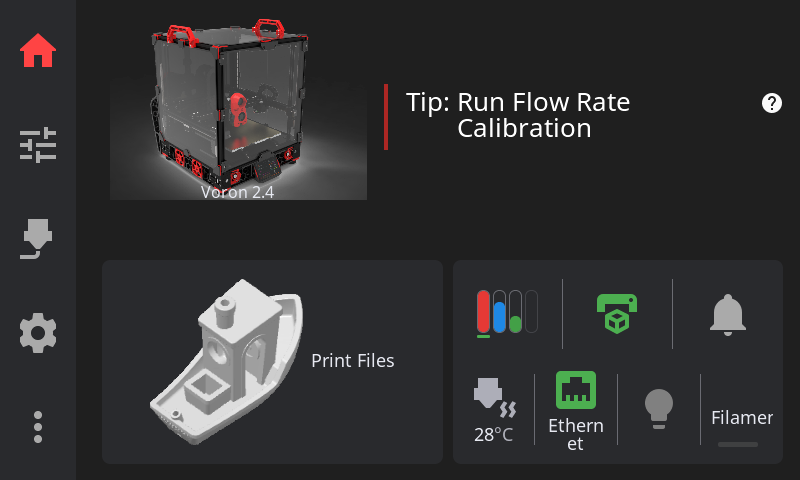
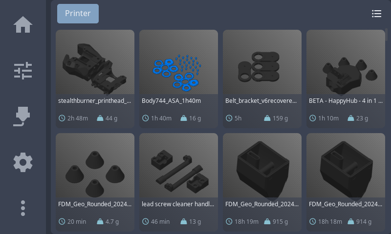
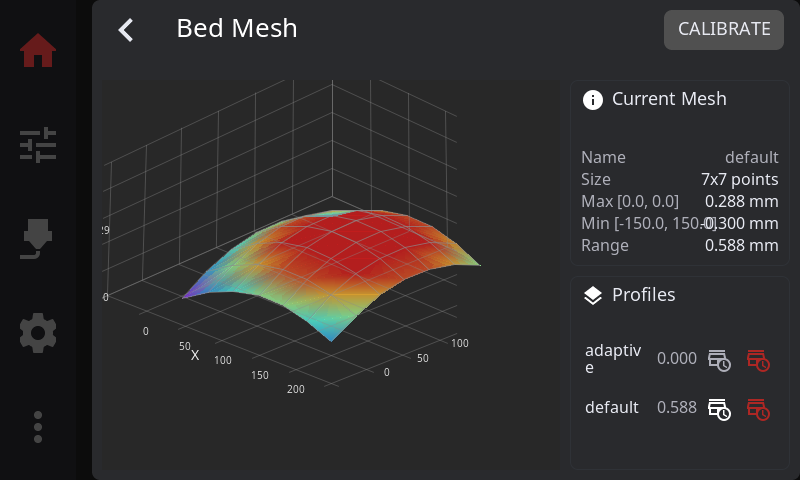

<p align="center">
  
  <br>
  <h1 align="center">HelixScreen</h1>
  <p align="center"><em>A modern touch interface for Klipper/Moonraker 3D printers</em></p>
</p>

<p align="center">
  <a href="https://github.com/prestonbrown/helixscreen/actions/workflows/build.yml"></a>
  <a href="https://github.com/prestonbrown/helixscreen/actions/workflows/quality.yml"></a>
  <a href="https://www.gnu.org/licenses/gpl-3.0"></a>
  <a href="https://lvgl.io/"></a>
  
  <a href="https://github.com/prestonbrown/helixscreen/releases"></a>
</p>

Your printer can do way more than your current touchscreen lets you. Bed mesh visualization, input shaper graphs, multi-material management, print history — it's all trapped in a browser tab. HelixScreen puts it at your fingertips.

Fast, beautiful, and built for every Klipper printer — from a Creality K1 to a tricked-out Voron or RatRig.

---

> **Beta Release — v0.9.13**
>
> Core features are complete and stabilizing. We're looking for testers across different printer setups.
>
> **Tested on:** Voron 2.4 (Raspberry Pi 5), Voron 0.2, Doron Velta, RatRig V-Core, FlashForge Adventurer 5M Pro ([Forge-X](https://github.com/DrA1ex/ff5m) firmware)
>
> **Raspberry Pi:** Both 64-bit and 32-bit Raspberry Pi OS are supported.
>
> **QIDI:** Supported with auto-detection heuristics and print start profile.
>
> **Snapmaker U1:** Cross-compile target with 480x320 display support.
>
> **Creality K1:** Binaries are included in the release but have **not been tested on hardware**. If you have a K1, we'd love your help verifying it works!
>
> **Creality K2:** Build target exists (ARM, static musl) but is **completely untested**. Stock Moonraker on port 4408 makes this a promising target. If you have a K2/K2 Plus with SSH access, we'd love your help!
>
> **Ready to help?** See [Installation](#installation). Found a bug? [Open an issue](https://github.com/prestonbrown/helixscreen/issues). Have an idea? [Request a feature](https://github.com/prestonbrown/helixscreen/issues/new?labels=enhancement).

---

**Quick Links:** [Features](#features) · [Screenshots](#screenshots) · [Installation](#installation) · [User Guide](docs/user/USER_GUIDE.md) · [FAQ](#faq) · [Contributing](docs/DEVELOPMENT.md#contributing) · [Roadmap](docs/ROADMAP.md) · [Community](#community)

---

## Why HelixScreen?

- **Every feature at your fingertips** — 31 panels, 17 overlays, and growing fast
- **Runs on anything** — ~10MB RAM, from a Creality K1 to a Raspberry Pi 5
- **Setup wizard** — Auto-discovers your printer's hardware and configures itself
- **Multi-material ready** — AFC, Happy Hare, tool changers, ValgACE, Spoolman
- **Looks great** — Light/dark themes, responsive layouts, smooth animations

<details>
<summary><strong>Technical comparison</strong></summary>

| Feature | HelixScreen | GuppyScreen | KlipperScreen |
|---------|-------------|-------------|---------------|
| UI Framework | LVGL 9 XML | LVGL 8 C | GTK 3 (Python) |
| Declarative UI | Full XML | C only | Python only |
| Disk Size | ~70-80MB | ~60-80MB | ~50MB |
| RAM Usage | ~10MB | ~15-20MB | ~50MB |
| Reactive Binding | Built-in | Manual | Manual |
| Status | Beta | Inactive | Mature (maintenance) |
| Language | C++17 | C | Python 3 |

</details>

## Screenshots

### Home Panel


### Print File Browser


### Bed Mesh Visualization


See [docs/GALLERY.md](docs/GALLERY.md) for all screenshots.

## Features

**Printer Control** — Print management, motion controls, temperature presets, fan control, Z-offset, live filament consumption tracking

**Multi-Material** — AFC, Happy Hare, tool changers, ValgACE, Spoolman integration

**Visualization** — G-code layer preview, 3D bed mesh, print thumbnails, frequency response charts

**Calibration** — Input shaper with frequency response charts, PID tuning with live temp graph, bed mesh, screws tilt, Z-offset, firmware retraction

**Integrations** — HelixPrint plugin, power devices, print history, timelapse, exclude objects, sound alerts

**Display** — Auto-detecting layout system (800×480, 1024×600, 1920×480 ultrawide), display rotation (0/90/180/270), light/dark themes

**System** — First-run wizard with telemetry opt-in, KIAUH installer, bundled uninstaller, versioned config migration, 60 printer models with auto-detection

## Installation

> **⚠️ Run these commands on your printer's host computer, not your local machine.**
>
> SSH into your Raspberry Pi, BTT CB1/Manta, or similar host as root. For all-in-one printers (Creality K1, K2 series, Adventurer 5M/Pro), SSH directly into the printer itself.

**Raspberry Pi / Creality K1:**
```bash
curl -sSL https://raw.githubusercontent.com/prestonbrown/helixscreen/main/scripts/install.sh | sh
```

**Adventurer 5M/Pro:** Requires downloading to your computer first, then copying to the printer (BusyBox lacks HTTPS support).

See [Installation Guide](docs/user/INSTALL.md) for detailed instructions, display configuration, and troubleshooting.

## Development

```bash
# Check/install dependencies
make check-deps && make install-deps

# Build
make -j

# Run with mock printer (no hardware needed)
./build/bin/helix-screen --test

# Run with real printer
./build/bin/helix-screen
```

**Controls:** Click navigation icons, press 'S' for screenshot, use `-v` or `-vv` for logging.

See [docs/DEVELOPMENT.md](docs/DEVELOPMENT.md) for detailed setup, cross-compilation, and test modes.

## FAQ

**Is HelixScreen production-ready?**
Beta status. Core features are stable and improving with each release. Suitable for enthusiasts willing to provide feedback.

**How is this different from GuppyScreen/KlipperScreen?**
More features, way less resource usage (~10MB RAM vs ~50MB for KlipperScreen), and actively developed. See the [comparison table](#why-helixscreen).

**Which printers are supported?**
Any Klipper + Moonraker printer. Tested on Voron 2.4, Voron 0.2, Doron Velta, RatRig V-Core, FlashForge Adventurer 5M Pro, and QIDI printers. Snapmaker U1 support included. Both 64-bit and 32-bit Raspberry Pi OS are supported. Creality K1 and K2 series binaries are available but untested. The wizard auto-discovers your printer's capabilities.

**What screen sizes are supported?**
800×480, 1024×600, and 1920×480 (ultrawide) are fully supported with auto-detecting layout system. Display rotation (0/90/180/270) is supported. Smaller displays like 480×320 (Snapmaker U1) are a work-in-progress.

**What multi-material systems work?**
AFC (Box Turtle), Happy Hare (ERCF, 3MS, Tradrack), tool changers, and ValgACE.

See [docs/user/FAQ.md](docs/user/FAQ.md) for the full FAQ.

## Troubleshooting

| Issue | Solution |
|-------|----------|
| SDL2 or build tools missing | `make install-deps` |
| Submodule empty | `git submodule update --init --recursive` |
| Can't connect to Moonraker | Check IP/port in helixconfig.json |
| Wizard not showing | Delete helixconfig.json to trigger it |

See [docs/user/TROUBLESHOOTING.md](docs/user/TROUBLESHOOTING.md) for more solutions, or open a [GitHub issue](https://github.com/prestonbrown/helixscreen/issues).

## Documentation

### User Guides
| Guide | Description |
|-------|-------------|
| [Installation](docs/user/INSTALL.md) | Setup for Pi, K1, K2, AD5M, QIDI, Snapmaker U1 |
| [User Guide](docs/user/USER_GUIDE.md) | Using HelixScreen |
| [FAQ](docs/user/FAQ.md) | Common questions |
| [Troubleshooting](docs/user/TROUBLESHOOTING.md) | Problem solutions |

### Developer Guides
| Guide | Description |
|-------|-------------|
| [Development](docs/DEVELOPMENT.md) | Build system, workflow, contributing |
| [Architecture](docs/ARCHITECTURE.md) | System design, patterns |
| [LVGL9 XML Guide](docs/LVGL9_XML_GUIDE.md) | XML syntax reference |
| [Gallery](docs/GALLERY.md) | All screenshots |
| [Roadmap](docs/ROADMAP.md) | Feature timeline |

## Community

**Discussion:**
- [FuriousForging Discord](https://discord.gg/Cg4yas4V) — #mods-and-projects ([jump to HelixScreen topic](https://discord.com/channels/1323351124069191691/1444485365376352276))
- [VORONDesign Discord](https://discord.gg/voron) — #voc_works ([jump to HelixScreen topic](https://discord.com/channels/460117602945990666/1468467369407156346))

I check in on these when I can, but they aren't official support channels — response times will vary. For reliable tracking of bugs and feature requests, use GitHub Issues.

**Bug Reports & Feature Requests:** [GitHub Issues](https://github.com/prestonbrown/helixscreen/issues) — this is the best way to reach me. Please include your printer model and logs (`helix-screen -vv`) when reporting bugs.

## License

GPL v3 — See individual source files for copyright headers.

## Acknowledgments

**Inspired by:** [GuppyScreen](https://github.com/ballaswag/guppyscreen) (general architecture, LVGL-based approach), [KlipperScreen](https://github.com/KlipperScreen/KlipperScreen) (feature inspiration)

**Stack:** [LVGL 9.4](https://lvgl.io/), [Klipper](https://www.klipper3d.org/), [Moonraker](https://github.com/Arksine/moonraker), [libhv](https://github.com/ithewei/libhv), [spdlog](https://github.com/gabime/spdlog), [SDL2](https://www.libsdl.org/)

**AI-Assisted Development:** HelixScreen was developed with the assistance of [Claude Code](https://github.com/anthropics/claude-code) and [Anthropic](https://www.anthropic.com/)'s Claude AI models
