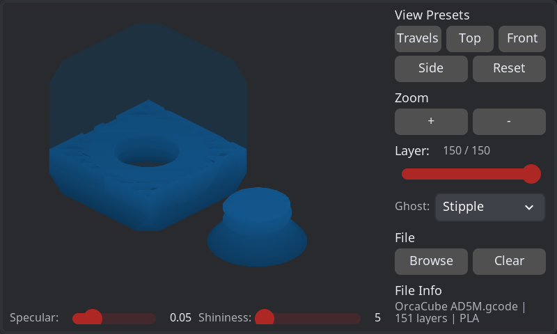

<p align="center">
  
  <br>
  <h1 align="center">HelixScreen</h1>
  <p align="center"><em>A modern, lightweight touch interface for Klipper/Moonraker 3D printers</em></p>
</p>

<p align="center">
  <a href="https://github.com/prestonbrown/helixscreen/actions/workflows/build.yml"></a>
  <a href="https://github.com/prestonbrown/helixscreen/actions/workflows/quality.yml"></a>
  <a href="https://www.gnu.org/licenses/gpl-3.0"></a>
  <a href="https://lvgl.io/"></a>
  
  <a href="https://en.cppreference.com/w/cpp/17"></a>
</p>

HelixScreen is a next-generation printer control interface built from the ground up using LVGL 9's declarative XML system. Designed for embedded hardware with limited resources, it brings advanced Klipper features to printers that ship with restrictive vendor UIs.

> ⚠️ **Development Status:** This project is in active development (Alpha/Prototype phase). Core functionality works, but expect breaking changes and incomplete features. See [Project Status](#project-status) for details.

**Quick Links:** [Features](#key-features) · [Screenshots](#screenshots) · [Getting Started](#quick-start) · [Requirements](#requirements) · [Documentation](#documentation) · [FAQ](#faq) · [Contributing](docs/CONTRIBUTING.md) · [Roadmap](docs/ROADMAP.md)

---

**Built on proven foundations:**
- Based on [GuppyScreen](https://github.com/ballaswag/guppyscreen) architecture and design patterns
- Potential integration with [KlipperScreen](https://github.com/KlipperScreen/KlipperScreen) features
- Modern XML-based UI with reactive data binding (LVGL 9.4)

## Why HelixScreen?

**Unique Advantages:**
- 🎯 **Declarative XML UI** - First printer interface with complete XML-based layout definition (unique in 3D printing space)
- ⚡ **No Recompilation** - Change UI layouts and themes without rebuilding
- 🔄 **Modern Reactive Patterns** - Subject-Observer data binding for automatic UI updates
- 💾 **Resource Efficient** - Designed for embedded hardware with ~50-80MB memory footprint
- 🏗️ **Built on Modern C++17** - Type-safe architecture with RAII memory management
- 🔌 **Pluggable Backends** - Clean abstraction layer for platform-specific implementations

**Key Goals:**
- 🚀 **More features** - Unlock Klipper's full potential beyond vendor limitations
- 💻 **Better hardware support** - Run on limited embedded devices (Pi, BTT Pad, vendor displays)
- 🎨 **Modern UI** - Clean, responsive touch interface with visual polish
- 📦 **Lightweight** - Minimal resource footprint for constrained hardware

### Feature Comparison

| Feature | HelixScreen | GuppyScreen | KlipperScreen |
|---------|-------------|-------------|---------------|
| **UI Framework** | LVGL 9 XML | LVGL 8 C++ | Gtk (Python) |
| **Declarative UI** | ✅ Full XML | ❌ C++ only | ❌ Python only |
| **No Recompile Changes** | ✅ XML edits | ❌ Need rebuild | ✅ Python edits |
| **Memory Footprint** | ~50-80MB | ~80-100MB | ~150-200MB |
| **Reactive Data Binding** | ✅ Built-in | ⚠️ Manual | ⚠️ Manual |
| **Theme System** | ✅ XML globals | ⚠️ Limited | ✅ CSS-like |
| **Embedded Target** | ✅ Optimized | ✅ Yes | ⚠️ Heavy |
| **Touch Optimization** | ✅ Native | ✅ Yes | ⚠️ Desktop-first |
| **Responsive Design** | ✅ Breakpoints | ⚠️ Limited | ⚠️ Fixed layouts |
| **Development Status** | 🚧 Alpha | ✅ Stable | ✅ Mature |
| **Backend** | libhv WebSocket | libhv WebSocket | Python Websocket |
| **Language** | C++17 | C++11 | Python 3 |
| **Build Time** | ~30s clean | ~25s clean | N/A (interpreted) |
| **First-Run Setup** | ✅ Auto-wizard | ⚠️ Manual config | ⚠️ Manual config |
| **G-code Preview** | ✅ 3D viewer | ❌ Not yet | ✅ 2D layers |
| **Bed Mesh Visual** | ✅ 3D gradient | ✅ 2D heatmap | ✅ 2D heatmap |

**Legend:** ✅ Full support | ⚠️ Partial/Limited | ❌ Not available | 🚧 In development

## Screenshots

### Home Panel


*Main dashboard showing printer status, temperatures, and quick actions*

### Print File Browser


*Card view with thumbnails, metadata, and file information - also supports sortable list view*

### Motion Controls


*Manual printer control with jog pad, distance selector, and position display*

### Controls Launcher


*Quick access to motion, temperature, extrusion, and other printer controls*

### First-Run Wizard


*Guided setup with auto-discovery of printer components*

### G-Code Viewer


*3D preview of G-code files with touch rotation (pending content loading)*

> 📸 **Note:** Screenshots auto-generated with `make screenshots` - regenerate after UI changes

## Key Features (What's Working Now)

### ✅ Complete & Working
- **Print File Browser** - Card and list views with sorting, filtering, and metadata display
- **File Management** - View print files, check metadata (time, filament), delete files
- **First-Run Wizard** - Auto-discovery of printer components with guided setup
- **Moonraker Integration** - Real-time WebSocket connection with auto-reconnect
- **Temperature Monitoring** - Live temperature display for hotend and bed
- **3D Visualizations** - G-code preview and bed mesh analysis with touch controls
- **Declarative XML UI** - Complete UI defined in XML with reactive data binding
- **Responsive Design** - Multiple screen sizes (480×320 to 1024×800+)
- **Light/Dark Themes** - Runtime theme switching with global color system
- **Touch-Optimized** - Numeric keypad, confirmation dialogs, overlay panels

### 🚧 In Progress
- **Motion Controls** - Manual printer control (jog, home, positioning)
- **Temperature Controls** - Preset and custom temperature management
- **Extrusion Controls** - Manual extrude/retract with safety checks
- **Print Job Control** - Start, pause, resume, cancel operations

### 📅 Planned
- Fan control, filament management, advanced settings
- See [ROADMAP.md](docs/ROADMAP.md) for complete feature timeline

## Target Hardware

- **Raspberry Pi** (Pi 3/4/5, Zero 2 W)
- **BTT Pad 7** / similar touch displays
- **Vendor printer displays** (Creality K1/K1 Max, FlashForge AD5M, etc.)
- **Generic Linux ARM/x64** with framebuffer support
- **Development simulator:** macOS/Linux desktop with SDL2

## Requirements

### Software Requirements
- **Klipper** - Any recent version (tested with 0.11.0+)
- **Moonraker** - Any recent version (tested with 0.8.0+)
- **Operating System:** Linux (Debian/Ubuntu/Arch) or macOS (for development only)
- **Build Tools:** CMake 3.15+, C++17 compiler (GCC 8+ / Clang 10+), Make, Python 3, npm

### Hardware Requirements (Target Embedded Devices)
- **CPU:** ARM Cortex-A7+ or x86_64 (500MHz+)
- **RAM:** 128MB minimum, 256MB+ recommended
- **Storage:** 50MB for application + 20MB for assets
- **Display:** 480×320 minimum, 800×480+ recommended
- **Touch:** Capacitive or resistive touchscreen
- **Network:** WiFi or Ethernet for Moonraker connection

### Development Requirements (SDL2 Simulator)
- **macOS:** 10.15+ (Catalina) or **Linux:** Any modern distribution
- **RAM:** 512MB+ available
- **Display:** Any resolution (will simulate target screen size)

## Quick Start

### Install Dependencies

**Automated setup:**
```bash
make check-deps     # Check what's missing
make install-deps   # Auto-install missing dependencies (interactive)
```

**Manual setup (macOS):**
```bash
brew install cmake python3 node
npm install  # Install lv_font_conv and lv_img_conv
# Optional (auto-built if missing): brew install sdl2 spdlog libhv
```

**Manual setup (Debian/Ubuntu):**
```bash
sudo apt install cmake python3 python3-venv clang make npm
npm install  # Install lv_font_conv and lv_img_conv
# Optional (auto-built if missing): sudo apt install libsdl2-dev spdlog libhv-dev
```

### Build & Run

```bash
# Build (parallel, auto-detects CPU cores)
make -j

# Run simulator (production mode - requires real hardware/printer)
./build/bin/helix-ui-proto

# Run in test mode (all components mocked - no hardware needed)
./build/bin/helix-ui-proto --test

# Test mode with selective real components
./build/bin/helix-ui-proto --test --real-moonraker      # Real printer, mock network
./build/bin/helix-ui-proto --test --real-wifi --real-files  # Real WiFi/files, mock rest

# Controls: Click navigation icons, press 'S' for screenshot
```

### Test Mode

The prototype includes a comprehensive test mode for development without hardware:

**Modes:**
- **Production Mode** (default): Never uses mocks, requires real hardware
- **Test Mode** (`--test`): Uses mock implementations for all components
- **Hybrid Mode**: Combine `--test` with `--real-*` flags to selectively enable real components

**Use Cases:**
| Scenario | Command | Purpose |
|----------|---------|---------|
| UI Development | `--test` | Work on layouts without any hardware |
| Frontend Testing | `--test --real-moonraker` | Test UI with real printer, mock network |
| Network Testing | `--test --real-wifi` | Test WiFi without printer connected |
| Integration Testing | `--test --real-moonraker --real-files` | Test file operations with real backend |
| Screenshot Automation | `--test` | Generate consistent screenshots for docs |
| CI/CD | `--test` | Run automated tests without hardware |

**Available `--real-*` Flags:**
- `--real-wifi` - Use real WiFi hardware (requires system WiFi support)
- `--real-ethernet` - Use real Ethernet hardware
- `--real-moonraker` - Connect to real Moonraker/printer (requires network access)
- `--real-files` - Use real file system operations (requires printer connection)

Test mode displays a banner showing which components are mocked vs real. This makes it easy to develop and test UI features without needing a physical 3D printer.

## Key Features

### Declarative XML UI System

Complete UI defined in XML files - no C++ layout code needed:

```xml
<!-- Define a panel in XML -->
<component>
  <view extends="lv_obj" style_bg_color="#bg_dark" style_pad_all="20">
    <lv_label text="Nozzle Temperature" style_text_color="#text_primary"/>
    <lv_label bind_text="temp_text" style_text_font="montserrat_28"/>
  </view>
</component>
```

```cpp
// C++ is pure logic - zero layout code
ui_panel_nozzle_init_subjects();
lv_xml_create(screen, "nozzle_panel", NULL);
ui_panel_nozzle_update(210);  // All bound widgets update automatically
```

### Reactive Data Binding

LVGL 9's Subject-Observer pattern enables automatic UI updates:
- **No manual widget management** - XML bindings handle everything
- **Type-safe updates** - One data change updates multiple UI elements instantly
- **Clean separation** - UI structure and business logic are independent

### Global Theme System

Change the entire UI appearance by editing one file (`ui_xml/globals.xml`):
```xml
<consts>
  <color name="primary_color" value="0xff4444"/>
  <color name="bg_dark" value="0x1a1a1a"/>
</consts>
```

## Project Status

**Current Development Phase:** Alpha / Prototype

**Completed Phases:**
- ✅ Phase 1-4: Foundation, navigation, print select panel with views
- ✅ Phase 8 (Partial): Moonraker WebSocket integration, file operations
- ✅ Phase 9 (Partial): Theme system, responsive layouts
- ✅ Phase 11 (Partial): First-run wizard with auto-discovery

**In Progress:**
- 🚧 Phase 5: Controls panel (motion, temperature, extrusion)
- 🚧 Phase 8: Full backend integration (job control, system management)
- 🚧 Phase 11: Wizard completion and testing

**What This Means:**
- Core UI framework is solid and feature-complete
- Basic printer monitoring and file management works
- Active development on printer control features
- API may have breaking changes before 1.0 release
- Ready for developer testing and contributions
- Not yet recommended for production use

See [ROADMAP.md](docs/ROADMAP.md) for detailed phase breakdown and upcoming features.

**Performance Metrics** (Current benchmarks):
- G-code Viewer: 99ms first render, 10.85MB memory, 30+ FPS
- Bed Mesh Renderer: 30+ FPS with gradient shading and touch rotation
- Memory Footprint: ~50-80MB typical usage

## FAQ

**Q: Is HelixScreen production-ready?**
A: Not yet. It's in active development (alpha/prototype phase). Core functionality works, but expect bugs and breaking changes. Suitable for developer testing and contributions.

**Q: How is this different from GuppyScreen and KlipperScreen?**
A: HelixScreen uses LVGL 9's declarative XML system for complete UI definition, enabling changes without recompilation. It's built specifically for resource-constrained embedded devices with a modern reactive architecture. GuppyScreen uses LVGL 8 with C++ layouts. KlipperScreen uses Gtk which has higher resource requirements.

**Q: Which printers are supported?**
A: Any 3D printer running Klipper + Moonraker. HelixScreen connects to your Moonraker instance and auto-discovers printer components.

**Q: Can I run this on a Raspberry Pi?**
A: Yes! Target hardware includes Pi 3/4/5, Zero 2 W, BTT Pad 7, and various vendor displays. Development currently uses SDL2 simulator; production framebuffer support is planned.

**Q: How do I contribute?**
A: See [CONTRIBUTING.md](docs/CONTRIBUTING.md) for code standards, testing guidelines, and PR process. Contributions welcome!

**Q: Where can I report bugs or request features?**
A: Open an issue on [GitHub Issues](https://github.com/prestonbrown/helixscreen/issues). Please include steps to reproduce and your system info.

**Q: What's the difference between test mode and production mode?**
A: Production mode requires real hardware (printer, network). Test mode (`--test`) uses mock implementations for development without hardware. Use `--real-*` flags for hybrid testing.

## Community & Support

- **Issues & Bug Reports:** [GitHub Issues](https://github.com/prestonbrown/helixscreen/issues)
- **Feature Requests:** [GitHub Issues](https://github.com/prestonbrown/helixscreen/issues) (use "enhancement" label)
- **Contributing:** [CONTRIBUTING.md](docs/CONTRIBUTING.md) - Code standards and PR workflow
- **Discussions:** [GitHub Discussions](https://github.com/prestonbrown/helixscreen/discussions) (if enabled)

**Getting Help:**
1. Check [FAQ](#faq) above for common questions
2. Review [Documentation](#documentation) for technical details
3. Search [existing issues](https://github.com/prestonbrown/helixscreen/issues) for similar problems
4. Open a new issue with detailed information (system specs, logs, steps to reproduce)

## Troubleshooting

**Build Issues:**
- **"CMake not found"** → Install CMake 3.15+ via package manager
- **"SDL2 not found"** → Let it auto-build from submodules, or install manually: `brew install sdl2` (macOS) / `sudo apt install libsdl2-dev` (Linux)
- **Compiler errors** → Ensure C++17 support: GCC 8+, Clang 10+, or MSVC 2019+
- **"lvgl submodule empty"** → Run `git submodule update --init --recursive`

**Runtime Issues:**
- **Black screen** → Check SDL2 initialization logs, verify display drivers
- **Cannot connect to Moonraker** → Verify Moonraker is running, check IP/port in helixconfig.json, test with curl
- **Touch not working** → SDL2 simulator uses mouse, verify mouse input device created
- **Slow performance** → Check debug logging level (use `-v` only when needed), verify GPU acceleration

**Configuration:**
- **First-run wizard not showing** → Delete helixconfig.json to trigger wizard
- **Themes not switching** → Verify globals.xml loaded, check theme registration logs
- **Subjects not updating** → Check subject initialization order, verify bindings in XML

For detailed troubleshooting, see [DEVELOPMENT.md](docs/DEVELOPMENT.md) or open a [GitHub issue](https://github.com/prestonbrown/helixscreen/issues).

## Architecture

```
XML Layout (ui_xml/*.xml)
    ↓ bind_text / bind_value / bind_flag
Reactive Subjects (lv_subject_t)
    ↓ lv_subject_set_* / copy_*
C++ Application Logic (src/*.cpp)
```

**Key Innovation:** The entire UI is defined in XML files. C++ code only handles initialization and reactive data updates—zero layout or styling logic.

## Documentation

### Getting Started
- **[Quick Start](#quick-start)** - Build and run in 5 minutes
- **[Requirements](#requirements)** - Software and hardware requirements
- **[Test Mode](#test-mode)** - Development without hardware

### User Guides
- **[FAQ](#faq)** - Frequently asked questions
- **[Project Status](#project-status)** - Current development phase and roadmap
- **[ROADMAP.md](docs/ROADMAP.md)** - Detailed feature timeline and milestones

### Development
- **[DEVELOPMENT.md](docs/DEVELOPMENT.md)** - Build system and daily workflow
- **[CONTRIBUTING.md](docs/CONTRIBUTING.md)** - Code standards and PR process
- **[ARCHITECTURE.md](docs/ARCHITECTURE.md)** - System design and patterns

### Technical Reference
- **[LVGL 9 XML Guide](docs/LVGL9_XML_GUIDE.md)** - Complete XML syntax reference
- **[Quick Reference](docs/QUICK_REFERENCE.md)** - Common patterns and code snippets
- **[BUILD_SYSTEM.md](docs/BUILD_SYSTEM.md)** - Build configuration and patches
- **[Testing Guide](docs/TESTING.md)** - Test infrastructure and Catch2 usage

## License

GPL v3 - See individual source files for copyright headers.

## Acknowledgments

**HelixScreen builds upon:**
- **[GuppyScreen](https://github.com/ballaswag/guppyscreen)** - Core architecture patterns, Moonraker WebSocket integration, and printer state management
- **[KlipperScreen](https://github.com/KlipperScreen/KlipperScreen)** - Feature inspiration, UI design concepts, and workflow patterns

**Technology Stack:**
- **[LVGL 9.4](https://lvgl.io/)** - Light and Versatile Graphics Library with XML support
- **[Klipper](https://www.klipper3d.org/)** - Advanced 3D printer firmware
- **[Moonraker](https://github.com/Arksine/moonraker)** - Klipper API server and WebSocket interface
- **[libhv](https://github.com/ithewei/libhv)** - High-performance network library for WebSocket client
- **[spdlog](https://github.com/gabime/spdlog)** - Fast C++ logging library
- **[SDL2](https://www.libsdl.org/)** - Cross-platform development and simulation
