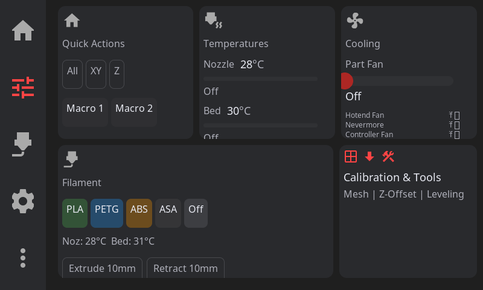
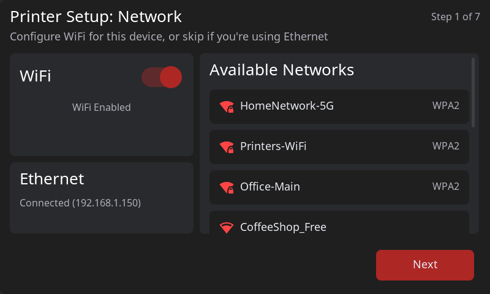
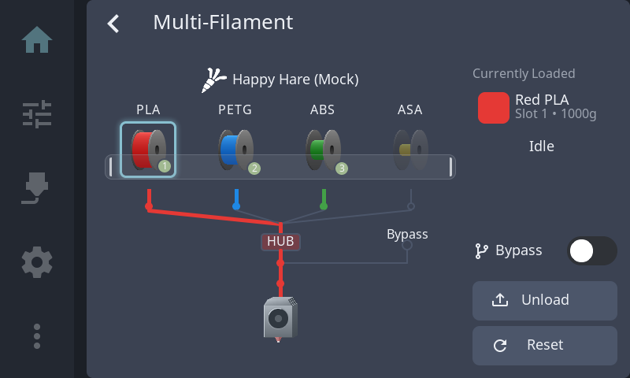
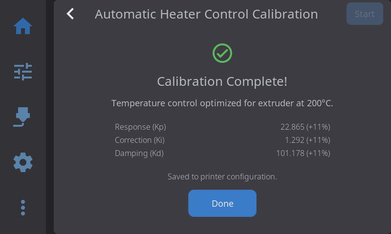
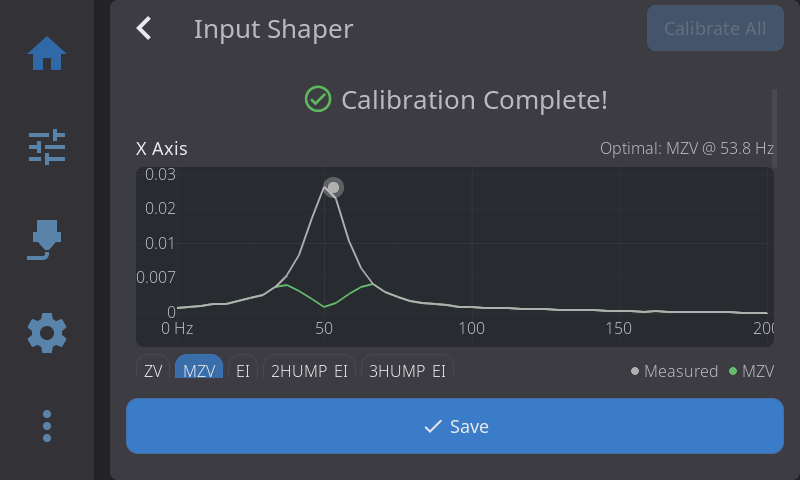

# Screenshot Gallery

Screenshots of HelixScreen's main panels and features. Auto-generated with `./scripts/screenshot.sh`.

---

## Home Panel

Main dashboard showing printer status, AMS filament status, temperatures, and quick actions.

---

## Controls Panel

Card-based control center with Quick Actions, Temperatures, Multi-Fan Cooling, Filament presets, and Calibration tools.

---

## Print File Browser

File selection with 3D thumbnail preview, print time estimates, filament requirements, and pre-print options.

---

## Motion Controls

Manual printer control with jog pad, distance selector, and live position display.

---

## Bed Mesh Visualization

3D bed mesh visualization with gradient coloring, mesh profiles, and calibration controls.

---

## Settings Panel

Comprehensive settings for appearance, input, printer configuration, and more.

---

## First-Run Wizard

Guided 8-step setup with WiFi configuration and auto-discovery of printer components.

---

## AMS Panel

AMS (Automatic Material System) management with filament slot configuration, color editing, and material presets.

---

## PID Tuning

Automatic PID calibration showing Kp/Ki/Kd results with percentage deltas from previous values.

---

## Input Shaper Results

Per-axis resonance analysis with frequency response charts, shaper comparison tables, and quality metrics.
