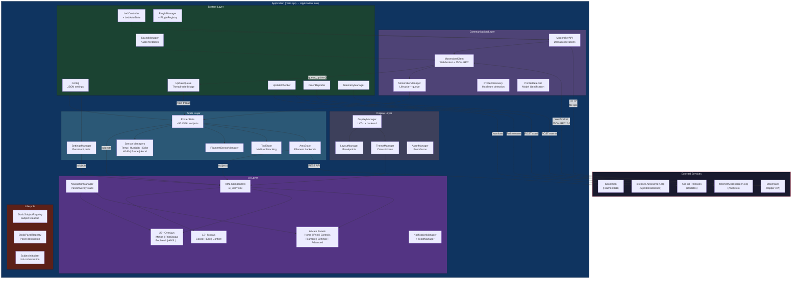

# System Overview

```mermaid
graph TB
    subgraph External["External Services"]
        MR["Moonraker<br/>(Klipper API)"]
        SP["Spoolman<br/>(Filament DB)"]
        GH["GitHub Releases<br/>(Updates)"]
        TEL["telemetry.helixscreen.org<br/>(Analytics)"]
        REL["releases.helixscreen.org<br/>(Symbols/Binaries)"]
    end

    subgraph App["Application (main.cpp → Application::run)"]

        subgraph Display["Display Layer"]
            DM["DisplayManager<br/>LVGL + backend"]
            TM["ThemeManager<br/>Colors/tokens"]
            LM["LayoutManager<br/>Breakpoints"]
            AM["AssetManager<br/>Fonts/icons"]
        end

        subgraph UI["UI Layer"]
            NAV["NavigationManager<br/>Panel/overlay stack"]
            PANELS["6 Main Panels<br/>Home | Print | Controls<br/>Filament | Settings | Advanced"]
            OVERLAYS["25+ Overlays<br/>Motion | PrintStatus<br/>BedMesh | AMS | ..."]
            MODALS["12+ Modals<br/>Cancel | Edit | Confirm"]
            TOAST["NotificationManager<br/>+ ToastManager"]
            XML["XML Components<br/>ui_xml/*.xml"]
        end

        subgraph State["State Layer"]
            PS["PrinterState<br/>~50 LVGL subjects"]
            AS["AmsState<br/>Filament backends"]
            TS["ToolState<br/>Multi-tool tracking"]
            SM["SettingsManager<br/>Persistent prefs"]
            FSM["FilamentSensorManager"]
            SENSORS["Sensor Managers<br/>Temp | Humidity | Color<br/>Width | Probe | Accel"]
        end

        subgraph Comms["Communication Layer"]
            MC["MoonrakerClient<br/>WebSocket + JSON-RPC"]
            MA["MoonrakerAPI<br/>Domain operations"]
            MM["MoonrakerManager<br/>Lifecycle + queue"]
            PD["PrinterDiscovery<br/>Hardware detection"]
            PDT["PrinterDetector<br/>Model identification"]
        end

        subgraph System["System Layer"]
            CFG["Config<br/>JSON settings"]
            UQ["UpdateQueue<br/>Thread-safe bridge"]
            SND["SoundManager<br/>Audio feedback"]
            UC["UpdateChecker"]
            CR["CrashReporter"]
            TLM["TelemetryManager"]
            LED["LedController<br/>+ LedAutoState"]
            PLG["PluginManager<br/>+ PluginRegistry"]
        end

        subgraph Lifecycle["Lifecycle"]
            SSR["StaticSubjectRegistry<br/>Subject cleanup"]
            SPR["StaticPanelRegistry<br/>Panel destruction"]
            SI["SubjectInitializer<br/>Init orchestration"]
        end
    end

    %% External connections
    MC <-->|"WebSocket<br/>JSON-RPC 2.0"| MR
    MA -->|"HTTP<br/>file ops"| MR
    AS -->|"REST API"| SP
    UC -->|"Poll releases"| GH
    TLM -->|"POST events"| TEL
    CR -->|"POST crash"| TEL
    UC -->|"Download"| REL

    %% Internal data flow
    MC --> MM --> PS
    PS --> AS
    PS --> TS
    PS --> FSM
    PS --> SENSORS
    MA --> MC

    %% UI binding
    PS -->|"subjects"| XML
    AS -->|"subjects"| XML
    SM -->|"subjects"| XML
    XML --> PANELS
    XML --> OVERLAYS
    XML --> MODALS

    %% Navigation
    NAV --> PANELS
    NAV --> OVERLAYS

    %% Threading bridge
    MC -->|"queue_update()"| UQ
    UQ -->|"main thread"| PS

    %% Display
    DM --> TM
    DM --> LM
    TM --> XML

    %% System
    CFG --> SM
    CFG --> PS
    SND --> MC
    LED --> MA
    PLG --> MA

    style External fill:#1a1a2e,stroke:#e94560,color:#fff
    style App fill:#0f3460,stroke:#16213e,color:#fff
    style UI fill:#533483,stroke:#16213e,color:#fff
    style State fill:#2b5876,stroke:#16213e,color:#fff
    style Comms fill:#4e4376,stroke:#16213e,color:#fff
    style System fill:#1b4332,stroke:#16213e,color:#fff
    style Display fill:#3d405b,stroke:#16213e,color:#fff
    style Lifecycle fill:#5c2018,stroke:#16213e,color:#fff
```
