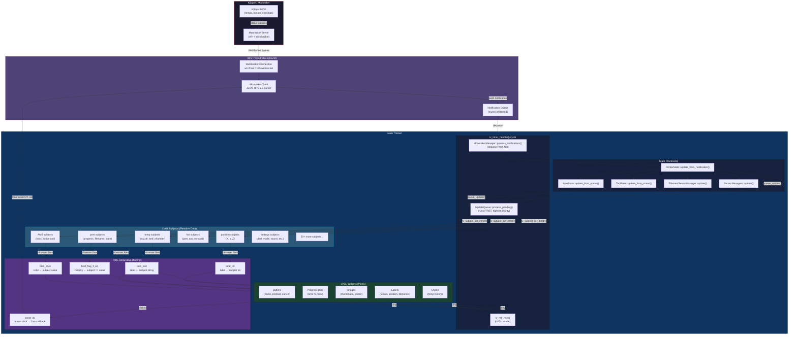

# Data Flow

How data flows from Moonraker through to pixels on screen.

## Key Points

1. **Thread boundary**: WebSocket callbacks (libhv thread) NEVER touch LVGL directly. Always go through `queue_update()`.
2. **UpdateQueue runs first**: Before rendering, ensuring subjects are current when widgets draw.
3. **Subjects are reactive**: XML bindings fire automatically when subject values change. No manual widget updates.
4. **Reverse flow**: User button clicks → `event_cb` → `MoonrakerAPI` → WebSocket → Moonraker.
5. **Observer safety**: `observe_int_sync` defers callbacks via `queue_update()` to prevent re-entrant crashes.
