# Threading Model

```mermaid
graph LR
    subgraph MainThread["MAIN THREAD (UI + LVGL)"]
        direction TB
        ML["Main Loop<br/>lv_timer_handler()"]

        subgraph Priority["Execution Order"]
            direction TB
            P1["1. UpdateQueue::process_pending()<br/>⚡ HIGHEST PRIORITY<br/>Drains queued lambdas"]
            P2["2. LVGL timers<br/>(input polling, animations)"]
            P3["3. process_notifications()<br/>Dequeue Moonraker JSON"]
            P4["4. lv_refr_now()<br/>🖥️ Render to framebuffer"]
            P1 --> P2 --> P3 --> P4
        end

        subgraph MainOwns["Main Thread Owns"]
            SUBJ["All LVGL subjects<br/>lv_subject_set_*()"]
            WIDGET["All LVGL widgets<br/>lv_obj_*()"]
            OBS["All observer callbacks"]
            THEME["Theme + layout changes"]
        end
    end

    subgraph LibHVThread["LIBHV THREAD (Network I/O)"]
        direction TB
        EL["libhv Event Loop"]

        subgraph LibHVOwns["libhv Thread Owns"]
            WSC["WebSocket connection"]
            JRPC["JSON-RPC parsing"]
            RECON["Auto-reconnect logic"]
            HTTP["HTTP file transfers"]
        end
    end

    subgraph UtilThreads["UTILITY THREADS"]
        direction TB
        UCT["UpdateChecker<br/>(GitHub polling)"]
        TLT["TelemetryManager<br/>(batch POST)"]
        CRT["CrashReporter<br/>(async collection)"]
    end

    subgraph Bridge["Thread-Safe Bridge"]
        direction TB
        UQ["UpdateQueue<br/>std::queue + mutex"]
        NQ["Notification Queue<br/>std::queue + mutex"]
        AF["Atomic Flags<br/>std::atomic<bool>"]
    end

    %% Connections
    LibHVThread -->|"queue_update(λ)"| UQ
    UtilThreads -->|"queue_update(λ)"| UQ
    LibHVThread -->|"push notification"| NQ

    UQ -->|"drain on main"| P1
    NQ -->|"drain on main"| P3

    UtilThreads -->|"atomic flags"| AF
    AF -->|"check on main"| ML

    style MainThread fill:#0f3460,stroke:#16213e,color:#fff
    style LibHVThread fill:#4e4376,stroke:#7b2d8e,color:#fff
    style UtilThreads fill:#1b4332,stroke:#16213e,color:#fff
    style Bridge fill:#ffd166,stroke:#f4a261,color:#000
    style Priority fill:#16213e,stroke:#0f3460,color:#fff
    style MainOwns fill:#16213e,stroke:#00b4d8,color:#fff
    style LibHVOwns fill:#3d2066,stroke:#7b2d8e,color:#fff
```



## Safety Rules

| Rule | Why |
|------|-----|
| **NEVER** call `lv_subject_set_*()` from background thread | LVGL is single-threaded; triggers "invalidate area not allowed during rendering" |
| **ALWAYS** use `helix::ui::queue_update()` from callbacks | Lambda queued, executed on main thread before render |
| **NEVER** block main thread | No `sleep()`, no synchronous HTTP, no mutex waits |
| **UpdateQueue runs FIRST** in main loop | Ensures subject values are current before widgets render |
| `observe_int_sync` defers via `queue_update()` | Prevents re-entrant observer destruction crashes (issue #82) |
| Use `observe_int_immediate` only when SAFE | Only if callback won't modify observer lifecycle |

## queue_update() Pattern

```cpp
// From libhv WebSocket callback (background thread):
void MoonrakerClient::on_status_update(const json& data) {
    int temp = data["extruder"]["temperature"].get<int>();

    // WRONG: lv_subject_set_int(&temp_subject, temp);  // CRASH!

    // RIGHT:
    helix::ui::queue_update([temp]() {
        lv_subject_set_int(&temp_subject, temp);  // Safe: runs on main thread
    });
}
```
