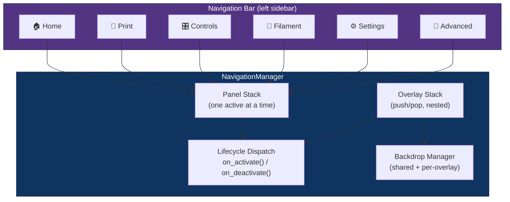
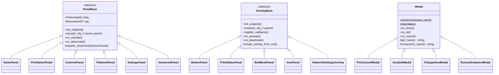
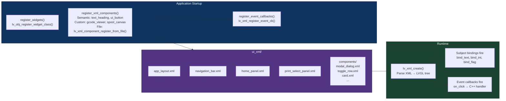

# UI Layer

## Navigation Architecture

```mermaid
graph TB
    subgraph NavBar["Navigation Bar (left sidebar)"]
        N1["🏠 Home"]
        N2["📁 Print"]
        N3["🎛️ Controls"]
        N4["🧵 Filament"]
        N5["⚙️ Settings"]
        N6["🔧 Advanced"]
    end

    subgraph NavMgr["NavigationManager"]
        PS["Panel Stack<br/>(one active at a time)"]
        OS["Overlay Stack<br/>(push/pop, nested)"]
        BD["Backdrop Manager<br/>(shared + per-overlay)"]
        LC["Lifecycle Dispatch<br/>on_activate() / on_deactivate()"]
    end

    N1 --> PS
    N2 --> PS
    N3 --> PS
    N4 --> PS
    N5 --> PS
    N6 --> PS

    PS --> LC
    OS --> LC
    OS --> BD

    style NavBar fill:#533483,stroke:#16213e,color:#fff
    style NavMgr fill:#0f3460,stroke:#16213e,color:#fff
```

## Panel / Overlay / Modal Hierarchy

```mermaid
graph TB
    subgraph Panels["Main Panels (PanelBase)"]
        HOME["HomePanel<br/>Dashboard, quick print,<br/>printer image, tips"]
        PRINT["PrintSelectPanel<br/>File browser, card/list view,<br/>sort, search, thumbnails"]
        CTRL["ControlsPanel<br/>5 smart cards: actions,<br/>temps, fans, calibration"]
        FIL["FilamentPanel<br/>Load/unload, presets,<br/>safety checks"]
        SET["SettingsPanel<br/>Display, sound, sensors,<br/>LED, plugins, about"]
        ADV["AdvancedPanel<br/>Power, macros, console,<br/>debug, memory stats"]
    end

    subgraph Overlays["Overlays (OverlayBase)"]
        subgraph StatusOverlays["Status (pinned)"]
            MOT["MotionPanel<br/>XYZ jog + homing"]
            PSTAT["PrintStatusPanel<br/>Progress, thumbnail,<br/>speed/flow, pause/cancel"]
        end

        subgraph CalibOverlays["Calibration"]
            MESH["BedMeshPanel"]
            ZOFF["ZOffsetCalibrationPanel"]
            PID["PidCalibrationPanel"]
            SCREW["ScrewsTiltPanel"]
            PROBE["ProbeOverlay"]
            ISHAP["InputShaperPanel"]
            TOUCH["TouchCalibrationOverlay"]
        end

        subgraph SettingsOverlays["Settings Sub-panels"]
            DISP["DisplaySettingsOverlay"]
            SOUND["SoundSettingsOverlay"]
            SENSOR["SensorSettingsOverlay"]
            LEDSET["LedSettingsOverlay"]
            HW["HardwareHealthOverlay"]
            LIMITS["MachineLimitsOverlay"]
            PLUGINS["SettingsPluginsOverlay"]
            MACBTN["MacroButtonsOverlay"]
            ABOUT["AboutOverlay"]
            TELDATA["TelemetryDataOverlay"]
        end

        subgraph FeatureOverlays["Feature"]
            AMS["AmsPanel<br/>Multi-backend filament"]
            AMSOV["AmsOverviewPanel"]
            SPMAN["SpoolmanPanel"]
            SWIZ["SpoolWizardOverlay"]
            AMSSPM["AmsSpoolmanOverlay"]
            AMSDEV["AmsDeviceOperationsOverlay"]
            HIST["HistoryDashboardPanel"]
            HISTL["HistoryListPanel"]
            CONS["ConsolePanel"]
            MACROS["MacrosPanel"]
            POWER["PowerPanel"]
            NHIST["NotificationHistoryPanel"]
            NET["NetworkSettingsOverlay"]
            TUNE["PrintTuneOverlay"]
            FAN["FanControlOverlay"]
            LED["LedControlOverlay"]
            THEME["ThemeEditorOverlay"]
            TLAPSE["TimelapseSettingsOverlay"]
            TLINST["TimelapseInstallOverlay"]
            RETRACT["RetractionSettingsOverlay"]
            PIMG["PrinterImageOverlay"]
            PMGR["PrinterManagerOverlay"]
            EXCL["ExcludeObjectsListOverlay"]
        end
    end

    subgraph Modals["Modals (Modal base)"]
        MCANCEL["PrintCancelModal"]
        MZOFF["SaveZOffsetModal"]
        MEDIT["AmsEditModal"]
        MAMERR["AmsLoadingErrorModal"]
        MEXCL["ExcludeObjectModal"]
        MHOST["ChangeHostModal"]
        MRUN["RunoutGuidanceModal"]
        MPLUG["PluginInstallModal"]
        MACT["ActionPromptModal"]
        MSPOOL["SpoolEditModal"]
        MCRASH["CrashReportModal"]
        MDEBUG["DebugBundleModal"]
    end

    %% Panel → Overlay triggers
    HOME -->|"tap temp"| MOT
    HOME -->|"tap print card"| PSTAT
    SET -->|"display"| DISP
    SET -->|"sound"| SOUND
    SET -->|"sensors"| SENSOR
    CTRL -->|"bed mesh"| MESH
    CTRL -->|"z-offset"| ZOFF
    ADV -->|"macros"| MACROS
    ADV -->|"console"| CONS
    ADV -->|"power"| POWER

    %% Overlay → Modal triggers
    PSTAT -->|"cancel"| MCANCEL
    AMS -->|"edit slot"| MEDIT
    AMS -->|"load error"| MAMERR

    style Panels fill:#533483,stroke:#16213e,color:#fff
    style Overlays fill:#2b5876,stroke:#16213e,color:#fff
    style Modals fill:#5c2018,stroke:#16213e,color:#fff
    style StatusOverlays fill:#1b4332,stroke:#16213e,color:#fff
    style CalibOverlays fill:#3d405b,stroke:#16213e,color:#fff
    style SettingsOverlays fill:#3d405b,stroke:#16213e,color:#fff
    style FeatureOverlays fill:#3d405b,stroke:#16213e,color:#fff
```

## Base Class Pattern

```mermaid
classDiagram
    class PanelBase {
        <<abstract>>
        +init_subjects()
        +setup(lv_obj_t* panel, parent)
        +on_activate()
        +on_deactivate()
        #register_observer(ObserverGuard)
        -PrinterState& state_
        -MoonrakerAPI* api_
    }

    class OverlayBase {
        <<abstract>>
        +init_subjects()
        +create(lv_obj_t* parent)
        +register_callbacks()
        +on_activate()
        +on_deactivate()
        #create_overlay_from_xml()
    }

    class Modal {
        +show(component_name)$
        +hide(dialog)$
        +on_show()
        +on_ok()
        +on_cancel()
        #get_name() string
        #component_name() string
    }

    PanelBase <|-- HomePanel
    PanelBase <|-- PrintSelectPanel
    PanelBase <|-- ControlsPanel
    PanelBase <|-- FilamentPanel
    PanelBase <|-- SettingsPanel
    PanelBase <|-- AdvancedPanel

    OverlayBase <|-- MotionPanel
    OverlayBase <|-- PrintStatusPanel
    OverlayBase <|-- BedMeshPanel
    OverlayBase <|-- AmsPanel
    OverlayBase <|-- NetworkSettingsOverlay

    Modal <|-- PrintCancelModal
    Modal <|-- AmsEditModal
    Modal <|-- ChangeHostModal
    Modal <|-- RunoutGuidanceModal
```

## XML Component System

```mermaid
graph LR
    subgraph Registration["Application Startup"]
        RW["register_widgets()<br/>lv_obj_register_widget_class()"]
        RC["register_xml_components()<br/>Semantic: text_heading, ui_button<br/>Custom: gcode_viewer, spool_canvas<br/>File: lv_xml_component_register_from_file()"]
        RE["register_event_callbacks()<br/>lv_xml_register_event_cb()"]
    end

    subgraph XMLFiles["ui_xml/"]
        AL["app_layout.xml"]
        NB["navigation_bar.xml"]
        HP["home_panel.xml"]
        PP["print_select_panel.xml"]
        COMP["components/<br/>modal_dialog.xml<br/>toggle_row.xml<br/>card.xml<br/>..."]
    end

    subgraph Runtime["Runtime"]
        LOAD["lv_xml_create()<br/>Parse XML → LVGL tree"]
        BIND["Subject bindings fire<br/>bind_text, bind_int, bind_flag"]
        EVT["Event callbacks fire<br/>on_click → C++ handler"]
    end

    RW --> RC --> RE
    RC --> XMLFiles
    XMLFiles --> LOAD --> BIND
    LOAD --> EVT

    style Registration fill:#0f3460,stroke:#16213e,color:#fff
    style XMLFiles fill:#533483,stroke:#16213e,color:#fff
    style Runtime fill:#1b4332,stroke:#16213e,color:#fff
```
