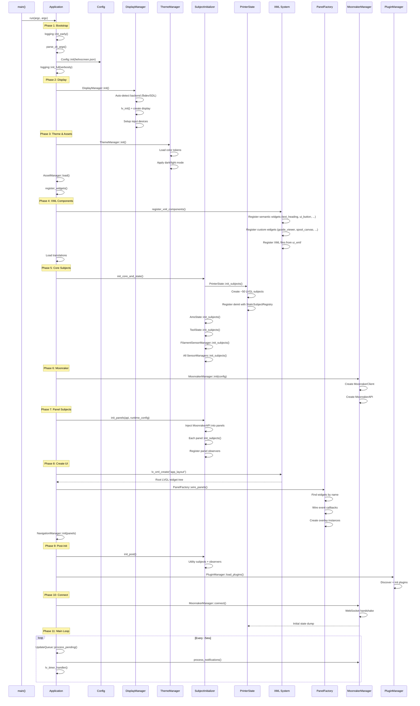
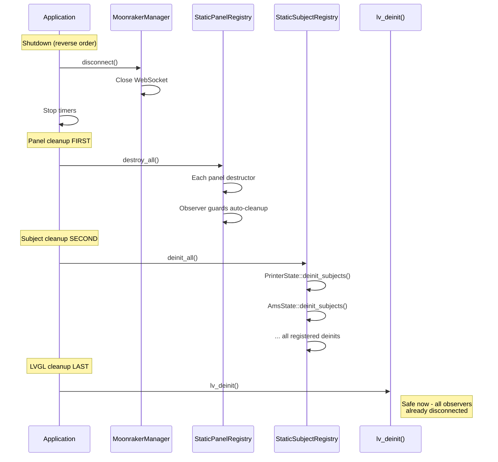

# Startup Sequence

```mermaid
sequenceDiagram
    participant M as main()
    participant A as Application
    participant C as Config
    participant DM as DisplayManager
    participant TH as ThemeManager
    participant SI as SubjectInitializer
    participant PS as PrinterState
    participant XML as XML System
    participant PF as PanelFactory
    participant MM as MoonrakerManager
    participant PLG as PluginManager

    M->>A: run(argc, argv)

    Note over A: Phase 1: Bootstrap
    A->>A: logging::init_early()
    A->>A: parse_cli_args()
    A->>C: Config::init(helixscreen.json)
    A->>A: logging::init_full(verbosity)

    Note over A: Phase 2: Display
    A->>DM: DisplayManager::init()
    DM->>DM: Auto-detect backend (fbdev/SDL)
    DM->>DM: lv_init() + create display
    DM->>DM: Setup input devices

    Note over A: Phase 3: Theme & Assets
    A->>TH: ThemeManager::init()
    TH->>TH: Load color tokens
    TH->>TH: Apply dark/light mode
    A->>A: AssetManager::load()
    A->>A: register_widgets()

    Note over A: Phase 4: XML Components
    A->>XML: register_xml_components()
    XML->>XML: Register semantic widgets (text_heading, ui_button, ...)
    XML->>XML: Register custom widgets (gcode_viewer, spool_canvas, ...)
    XML->>XML: Register XML files from ui_xml/
    A->>A: Load translations

    Note over A: Phase 5: Core Subjects
    A->>SI: init_core_and_state()
    SI->>PS: PrinterState::init_subjects()
    PS->>PS: Create ~50 LVGL subjects
    PS->>PS: Register deinit with StaticSubjectRegistry
    SI->>SI: AmsState::init_subjects()
    SI->>SI: ToolState::init_subjects()
    SI->>SI: FilamentSensorManager::init_subjects()
    SI->>SI: All SensorManagers::init_subjects()

    Note over A: Phase 6: Moonraker
    A->>MM: MoonrakerManager::init(config)
    MM->>MM: Create MoonrakerClient
    MM->>MM: Create MoonrakerAPI

    Note over A: Phase 7: Panel Subjects
    A->>SI: init_panels(api, runtime_config)
    SI->>SI: Inject MoonrakerAPI into panels
    SI->>SI: Each panel::init_subjects()
    SI->>SI: Register panel observers

    Note over A: Phase 8: Create UI
    A->>XML: lv_xml_create("app_layout")
    XML-->>A: Root LVGL widget tree
    A->>PF: PanelFactory::wire_panels()
    PF->>PF: Find widgets by name
    PF->>PF: Wire event callbacks
    PF->>PF: Create overlay instances
    A->>A: NavigationManager::init(panels)

    Note over A: Phase 9: Post-Init
    A->>SI: init_post()
    SI->>SI: Utility subjects + observers
    A->>PLG: PluginManager::load_plugins()
    PLG->>PLG: Discover + init plugins

    Note over A: Phase 10: Connect
    A->>MM: MoonrakerManager::connect()
    MM->>MM: WebSocket handshake
    MM-->>PS: Initial state dump

    Note over A: Phase 11: Main Loop
    loop Every ~5ms
        A->>A: UpdateQueue::process_pending()
        A->>MM: process_notifications()
        A->>A: lv_timer_handler()
    end
```

## Shutdown Sequence

```mermaid
sequenceDiagram
    participant A as Application
    participant MM as MoonrakerManager
    participant SPR as StaticPanelRegistry
    participant SSR as StaticSubjectRegistry
    participant LVGL as lv_deinit()

    Note over A: Shutdown (reverse order)
    A->>MM: disconnect()
    MM->>MM: Close WebSocket
    A->>A: Stop timers

    Note over A: Panel cleanup FIRST
    A->>SPR: destroy_all()
    SPR->>SPR: Each panel destructor
    SPR->>SPR: Observer guards auto-cleanup

    Note over A: Subject cleanup SECOND
    A->>SSR: deinit_all()
    SSR->>SSR: PrinterState::deinit_subjects()
    SSR->>SSR: AmsState::deinit_subjects()
    SSR->>SSR: ... all registered deinits

    Note over A: LVGL cleanup LAST
    A->>LVGL: lv_deinit()
    Note right of LVGL: Safe now - all observers<br/>already disconnected
```
