# Singleton Map

All 40+ singletons organized by responsibility.

```mermaid
graph TB
    subgraph CoreState["Core State (LVGL Subjects + StaticSubjectRegistry)"]
        PS["PrinterState<br/>~50 subjects: temps, motion,<br/>print progress, errors"]
        AS["AmsState<br/>Filament backends:<br/>AFC | HappyHare | ValgACE | ToolChanger"]
        TS["ToolState<br/>Multi-tool tracking"]
        SM["SettingsManager<br/>Persistent preferences"]
        TLS["TimelapseState<br/>Recording + render progress"]
        FSM["FilamentSensorManager<br/>Runout detection"]
    end

    subgraph Sensors["Sensor Managers (LVGL Subjects + StaticSubjectRegistry)"]
        TEMP["TemperatureSensorManager"]
        HUM["HumiditySensorManager"]
        COLOR["ColorSensorManager"]
        WIDTH["WidthSensorManager"]
        PROBE["ProbeOffsetSensorManager"]
        ACCEL["AccelSensorManager"]
    end

    subgraph UINav["UI / Navigation"]
        NAV["NavigationManager<br/>Panel + overlay stack"]
        MS["ModalStack<br/>Dialog stacking"]
        NM["NotificationManager<br/>Toasts + alerts"]
        TOM["ToastManager<br/>Toast lifecycle"]
        KBM["KeyboardManager<br/>Numeric keypad"]
        NH["NotificationHistory"]
        UNH["UINotificationHistory"]
    end

    subgraph DisplayRender["Display / Rendering"]
        DM["DisplayManager<br/>LVGL + backend"]
        TM["ThemeManager<br/>Colors + tokens"]
        LM["LayoutManager<br/>Breakpoints sm/md/lg"]
        PIM["PrinterImageManager<br/>Model image cache"]
        TP["ThumbnailProcessor<br/>G-code thumbnails"]
    end

    subgraph Communication["Communication"]
        UQ["UpdateQueue<br/>Thread-safe UI bridge"]
        SND["SoundManager<br/>M300 / SDL audio"]
        STM["StandardMacros<br/>Built-in G-code"]
    end

    subgraph SystemMon["System / Monitoring"]
        UC["UpdateChecker<br/>GitHub releases"]
        CR["CrashReporter"]
        MM["MemoryMonitor<br/>LVGL heap tracking"]
        SP["StreamingPolicy"]
        TIPS["TipsManager"]
        TLM["TelemetryManager<br/>Opt-in analytics"]
    end

    subgraph Plugins["Plugin System"]
        PLG["PluginManager"]
        PR["PluginRegistry<br/>Service locator"]
        IPM["InjectionPointManager<br/>UI injection"]
        ED["EventDispatcher"]
    end

    subgraph LED["LED System"]
        LC["LedController<br/>Hardware interface"]
        LAS["LedAutoState<br/>Automation rules"]
    end

    subgraph Lifecycle["Lifecycle Management"]
        SSR["StaticSubjectRegistry<br/>Subject cleanup ordering"]
        SPR["StaticPanelRegistry<br/>Panel destruction ordering"]
        SI["SubjectInitializer<br/>Phased init"]
        SDR["SubjectDebugRegistry"]
    end

    subgraph Config["Configuration"]
        CFG["Config<br/>JSON file loader/saver"]
    end

    subgraph Safety["Safety"]
        ABM["AbortManager<br/>Emergency stop"]
    end

    %% Key dependencies
    CFG -->|"read settings"| SM
    CFG -->|"read defaults"| PS
    PS -->|"state updates"| AS
    PS -->|"state updates"| TS
    PS -->|"state updates"| FSM
    UQ -->|"main thread bridge"| PS
    SM -->|"subjects"| NAV
    SSR -->|"cleanup"| CoreState
    SSR -->|"cleanup"| Sensors
    SPR -->|"cleanup"| UINav

    style CoreState fill:#2b5876,stroke:#00b4d8,color:#fff
    style Sensors fill:#2b5876,stroke:#16213e,color:#fff
    style UINav fill:#533483,stroke:#16213e,color:#fff
    style DisplayRender fill:#3d405b,stroke:#16213e,color:#fff
    style Communication fill:#4e4376,stroke:#16213e,color:#fff
    style SystemMon fill:#1b4332,stroke:#16213e,color:#fff
    style Plugins fill:#5c4827,stroke:#16213e,color:#fff
    style LED fill:#5c4827,stroke:#16213e,color:#fff
    style Lifecycle fill:#5c2018,stroke:#16213e,color:#fff
    style Config fill:#1a1a2e,stroke:#16213e,color:#fff
    style Safety fill:#5c2018,stroke:#e94560,color:#fff
```

## Singleton Summary Table

| Category | Singleton | LVGL Subjects | Auto-Deinit | Key File |
|----------|-----------|:---:|:---:|----------|
| **Core State** | PrinterState | ~50 | Yes | `printer_state.h` |
| | AmsState | Yes | Yes | `ams_state.h` |
| | ToolState | Yes | Yes | `tool_state.h` |
| | SettingsManager | Yes | Yes | `settings_manager.h` |
| | TimelapseState | Yes | Yes | `timelapse_state.h` |
| | FilamentSensorManager | Yes | Yes | `filament_sensor_manager.h` |
| **Sensors** | TemperatureSensorManager | Yes | Yes | `temperature_sensor_manager.h` |
| | HumiditySensorManager | Yes | Yes | `humidity_sensor_manager.h` |
| | ColorSensorManager | Yes | Yes | `color_sensor_manager.h` |
| | WidthSensorManager | Yes | Yes | `width_sensor_manager.h` |
| | ProbeOffsetSensorManager | Yes | Yes | `probe_sensor_manager.h` |
| | AccelSensorManager | Yes | Yes | `accel_sensor_manager.h` |
| **UI/Nav** | NavigationManager | Yes | - | `ui_nav_manager.h` |
| | ModalStack | - | - | `ui_modal.h` |
| | NotificationManager | Yes | - | `ui_notification_manager.h` |
| | ToastManager | - | - | `ui_toast_manager.h` |
| | KeyboardManager | - | - | `ui_keyboard_manager.h` |
| **Display** | DisplayManager | - | - | `display_manager.h` |
| | ThemeManager | - | - | `theme_manager.h` |
| | LayoutManager | - | - | `layout_manager.h` |
| | PrinterImageManager | - | - | `printer_image_manager.h` |
| | ThumbnailProcessor | - | - | `thumbnail_processor.h` |
| **Comms** | UpdateQueue | - | - | `ui_update_queue.h` |
| | SoundManager | - | - | `sound_manager.h` |
| **System** | UpdateChecker | - | - | `system/update_checker.h` |
| | CrashReporter | - | - | `system/crash_reporter.h` |
| | TelemetryManager | Yes | - | `system/telemetry_manager.h` |
| | MemoryMonitor | - | - | `memory_monitor.h` |
| **Plugins** | PluginManager | - | - | `plugin_manager.h` |
| | PluginRegistry | - | - | `plugin_registry.h` |
| | EventDispatcher | - | - | `plugin_events.h` |
| **LED** | LedController | - | - | `led/led_controller.h` |
| | LedAutoState | Yes | Yes | `led/led_auto_state.h` |
| **Lifecycle** | StaticSubjectRegistry | - | N/A | `static_subject_registry.h` |
| | StaticPanelRegistry | - | - | `static_panel_registry.h` |
| | SubjectInitializer | - | - | `subject_initializer.h` |
| **Config** | Config | - | - | `config.h` |
| **Safety** | AbortManager | - | - | `abort_manager.h` |
