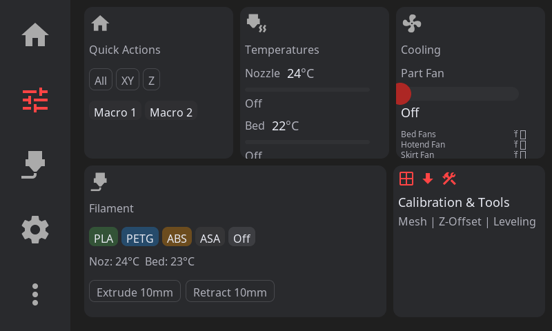

# HelixScreen User Guide

Learn how to use HelixScreen to control your 3D printer.

---

## Table of Contents

- [Navigation Overview](#navigation-overview)
- [Home Panel](#home-panel)
- [Starting a Print](#starting-a-print)
- [During a Print](#during-a-print)
- [Controls Panel](#controls-panel)
- [Settings](#settings)
- [Advanced Features](#advanced-features)
- [Keyboard & Input](#keyboard--input)
- [Tips & Tricks](#tips--tricks)

---

## Navigation Overview

HelixScreen uses a consistent navigation pattern with a **left sidebar** containing five navigation buttons:

| Icon | Panel | Purpose |
|------|-------|---------|
| Home | Home | Printer status at a glance |
| Tune | Controls | Motion, temperature, fan controls |
| Spool | Filament | Load, unload, filament profiles |
| Gear | Settings | Display, sound, network options |
| Dots | Advanced | Calibration, history, system tools |

> **Note:** Print Select is accessed from the **Home panel** (tap the print area), not from the navbar. Controls and Filament require a printer connection and appear disabled when disconnected.

### Navigation Tips

- **Tap** an icon to switch panels
- **Current panel** is highlighted
- **Back button** (arrow) returns from sub-panels
- **Swipe** to scroll long lists

### Connection Status

The home panel shows connection status:
- **Green checkmark:** Connected to printer
- **Red X:** Disconnected (shows reconnection toast)
- **Yellow exclamation:** Klipper not ready (firmware restart needed)

---

## Home Panel


The Home Panel is your dashboard for printer status.

### Status Area

At the top, you'll see:
- **Printer state:** Idle, Printing, Paused, etc.
- **Print progress:** Percentage and time remaining (when printing)
- **Connection status:** Connected/Disconnected indicator

### Temperature Displays

Real-time temperature readouts:
- **Nozzle temperature:** Current / Target
- **Bed temperature:** Current / Target
- **Chamber temperature:** (if equipped)

**Tap** a temperature display to jump to its control panel.

### AMS/Filament Status

If you have a multi-material system (Happy Hare, AFC-Klipper):
- Visual display of loaded filament slots
- Current active slot highlighted
- Color-coded by filament type

### Quick Actions

Buttons for common operations:
- **LED Toggle:** Turn chamber lights on/off
- **Emergency Stop:** Halt all motion (confirmation required)

---

## Starting a Print

### Step 1: Browse Files

1. From the **Home panel**, tap the print file area to open Print Select
2. Browse your G-code files

### Step 2: View Options

**Card View** (default): Shows thumbnails with file info
- File name
- Estimated print time
- Filament usage
- Slicer (OrcaSlicer, PrusaSlicer, etc.)

**List View**: Compact view for many files
- Toggle with the view button in top-right

### Step 3: Sort & Filter

Tap the sort button to organize files by:
- **Name** (A-Z or Z-A)
- **Modified date** (newest or oldest)
- **Size** (largest or smallest)
- **Print time** (longest or shortest)

### Step 4: Select a File

Tap a file to open the **preview panel**:
- **3D G-code preview** (rotatable with touch)
- **Layer slider** for inspection
- **File metadata** (size, time, filament)
- **Pre-print options**

### Step 5: Pre-Print Options

Before starting, you can enable/disable:
- **Auto bed level:** Run mesh before print
- **Quad gantry level:** QGL calibration
- **Z-tilt adjust:** Z-tilt calibration
- **Nozzle clean:** Run cleaning macro

These options modify the G-code on-the-fly, commenting out embedded operations if you disable them.

### Step 6: Start Print

Tap **Start Print** to begin. The UI switches to the Print Status panel.

---

## During a Print

The Print Status panel shows live print progress.

### Progress Display

- **Circular progress indicator** with percentage
- **Time elapsed** and **time remaining**
- **Current layer** / total layers
- **Filename** being printed

### Controls During Print

**Pause/Resume:** Temporarily halt the print
- Printer parks the nozzle safely
- Tap again to resume

**Cancel:** Stop the print (confirmation required)
- Prompts "Are you sure?" to prevent accidents

**Z-Offset Adjustment:** Fine-tune first layer
- Tap +/- buttons to adjust in small increments
- Changes applied immediately
- Persists for the entire print

### Exclude Object

If your slicer supports it (OrcaSlicer, SuperSlicer):
- Tap **Exclude Object** to see printable objects
- Select an object to skip (e.g., failed part)
- **Undo** available for 5 seconds after exclusion

### Temperature Monitoring

Live temperature graphs show:
- Nozzle and bed temperatures
- Target lines for reference
- History over time

---

## Controls Panel



The Controls Panel provides access to all printer adjustments, organized into cards.

### Motion Controls

**Jog Pad:** Move print head manually
- X/Y crosshair for horizontal movement
- Z buttons for up/down
- Distance selector: 0.1mm, 1mm, 10mm, 100mm

**Home Buttons:**
- **Home All:** X, Y, and Z
- **Home XY:** Only X and Y axes
- **Home Z:** Only Z axis (probe required)

**Position Display:** Shows current X, Y, Z coordinates

### Temperature Controls

**Nozzle Panel:**
- Current temperature display
- Target temperature input
- **Presets:** Off, PLA (210°C), PETG (240°C), ABS (250°C)
- Temperature graph

**Bed Panel:**
- Current temperature display
- Target temperature input
- **Presets:** Off, PLA (60°C), PETG (80°C), ABS (100°C)
- Temperature graph

### Extrusion Panel

Control filament movement:
- **Extrude:** Push filament through nozzle
- **Retract:** Pull filament back
- **Amount selector:** 5mm, 10mm, 25mm, 50mm
- **Speed selector:** Slow, Normal, Fast

**Safety:** Requires hotend at minimum temperature

### Fan Controls

Control all configured fans:
- **Part cooling fan:** 0-100%
- **Hotend fan:** Usually automatic
- **Auxiliary fans:** If configured

Sliders for fine control, or tap percentage to type exact value.

### Bed Mesh

3D visualization of bed surface:
- **Color gradient:** Blue (low) to Red (high)
- **Touch to rotate** the view
- **Mesh profile selector:** Switch between saved meshes

Actions:
- **Calibrate:** Run new mesh probing
- **Clear:** Remove current mesh
- **Load:** Load a saved profile

### PID Tuning

Calibrate temperature controllers:
- Select **Nozzle** or **Bed**
- Enter target temperature
- Run automatic tuning
- Save results to configuration

---

## Settings


Access settings via the **Gear icon** in the navigation bar.

### Display Settings

- **Theme:** Dark or Light mode
- **Brightness:** Display backlight level (0-100%)
- **Sleep timeout:** Screen dimming delay (1-30 minutes, or Never)
- **Scroll sensitivity:** Adjust touch scrolling responsiveness

### Sound Settings

- **Enable sounds:** Toggle all sound effects
- **Test beep:** Plays a test tone (M300 command)

### Network Settings

- **WiFi:** Connect to wireless networks
- **Moonraker:** Change printer connection

### Safety Settings

- **E-Stop confirmation:** Require confirmation before emergency stop

### Calibration

- **Bed mesh:** Enter mesh calibration panel
- **Z-offset:** Calibrate Z probe offset
- **PID tuning:** Tune heater PID values

### Advanced

- **Factory reset:** Clear all settings and run wizard again
- **Restart Klipper:** Restart Klipper firmware
- **About:** Version information

---

## Advanced Features

### Macro Panel

Execute custom Klipper macros:

1. Navigate to **Controls > Macros**
2. Browse available macros (alphabetically sorted)
3. Tap a macro to execute immediately

**Notes:**
- System macros (starting with `_`) are hidden by default
- Macro names are "prettified" (CLEAN_NOZZLE → "Clean Nozzle")
- Dangerous macros (SAVE_CONFIG, etc.) require confirmation

### Console Panel

View G-code command history:

1. Navigate to **Controls > Console**
2. Scroll through recent commands and responses

**Color coding:**
- **White:** Commands you sent
- **Green:** Successful responses
- **Red:** Errors and warnings

### Power Device Control

Control Moonraker power devices:

1. Navigate to **Controls > Power**
2. Toggle devices on/off with switches

**Notes:**
- Devices locked during prints (safety feature)
- Lock icon shows which devices are protected

### Print History

View past print jobs:

1. Navigate to **Advanced > Print History**

**Dashboard view:**
- Total prints, success rate
- Print time and filament usage statistics
- Trend graphs

**List view:**
- Search by filename
- Filter by status (completed, failed, cancelled)
- Sort by date, duration, or name

**Detail view:**
- Tap any job for full details
- **Reprint:** Start the same file again
- **Delete:** Remove from history

### Timelapse Settings

Configure Moonraker-Timelapse:

1. Navigate to **Advanced > Timelapse**
2. Enable/disable timelapse recording
3. Select mode:
   - **Layer Macro:** Snapshot at each layer
   - **Hyperlapse:** Time-based snapshots
4. Set framerate (15/24/30/60 fps)
5. Enable auto-render for automatic video creation

---

## Keyboard & Input

### On-Screen Keyboard

The keyboard appears automatically when text input is needed:

- **QWERTY layout** with number row
- **Long-press** for alternate characters (e.g., hold 'a' for '@')
- **Mode buttons:** ?123 for symbols, ABC for letters
- **Shift** for uppercase

### Touch Gestures

- **Tap:** Select, button press
- **Swipe:** Scroll lists and panels
- **Long press:** Alternative characters (keyboard)
- **Pinch/spread:** Zoom in 3D views (if supported)

### Developer Shortcuts

When using SDL2 development simulator:
- **S key:** Take screenshot (saves to /tmp/)
- **Escape:** Exit application

---

## Tips & Tricks

### Temperature Shortcuts

Tap a temperature display on the Home panel to jump directly to its control panel.

### Quick Navigation

From any sub-panel, the navigation bar always takes you back to main panels.

### Pre-Print Checks

The pre-print options remember your last choices per slicer. If you always run bed mesh before PrusaSlicer prints, that preference persists.

### Disconnection Handling

If connection is lost:
1. HelixScreen shows a reconnection toast
2. Automatic reconnection attempts every few seconds
3. When reconnected, state is restored automatically
4. During disconnection, Controls and Filament panels are disabled (safety)

### AMS/Multi-Material

For Happy Hare or AFC-Klipper systems:
- Slot status shows on home panel
- Use Filament panel for load/unload operations
- Color information comes from Spoolman (if integrated)

### Memory Usage

HelixScreen is optimized for low memory:
- Typical usage: 50-80MB
- No X server or desktop environment needed
- Direct framebuffer rendering

### Log Viewing

For troubleshooting, view logs from SSH:
```bash
# Live logs
sudo journalctl -u helixscreen -f

# Last 100 lines
sudo journalctl -u helixscreen -n 100
```

---

*Next: [Troubleshooting](TROUBLESHOOTING.md) - Solutions to common problems*
