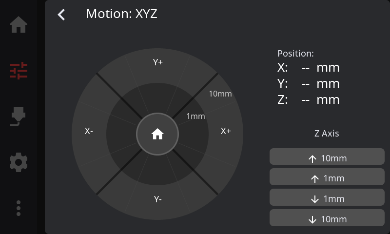
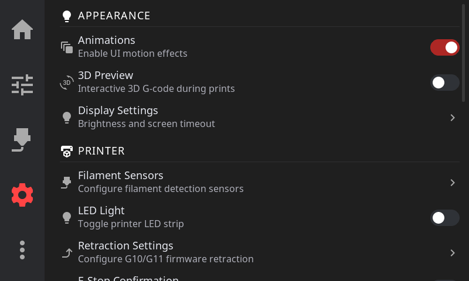

# HelixScreen User Guide

Complete guide to using HelixScreen, the touchscreen UI for Klipper 3D printers.

---

## Quick Reference

| Sidebar Icon | Panel | What You'll Do There |
|--------------|-------|----------------------|
| Home | Home | Monitor status, start prints, view temperatures |
| Tune | Controls | Move axes, set temperatures, control fans |
| Spool | Filament | Load/unload filament, manage AMS slots |
| Gear | Settings | Configure display, sound, LED, network, sensors |
| More | Advanced | Calibration, history, macros, system tools |

---

## Guide Contents

### [Getting Started](guide/getting-started.md)
Navigation basics, touch gestures, connection status, first-time setup wizard, WiFi configuration, and keyboard input.

### [Home Panel](guide/home-panel.md)
Your printer dashboard — status area, configurable home widgets (temperature, network, LED, AMS, power, notifications, and more), active tool badge for toolchanger printers, emergency stop, and the Printer Manager with custom images. Customize which widgets appear and their order via **Settings > Home Widgets**. Long-press the lightbulb widget for full LED controls with color, brightness, effects, and WLED presets.

### [Printing](guide/printing.md)
The full printing workflow — file selection, preview, pre-print options, monitoring active prints, tune overlay, Z-offset baby steps, pressure advance, exclude object, and post-print summary.

### [Temperature Control](guide/temperature.md)
Nozzle and bed temperature panels, multi-extruder selector for printers with multiple extruders, material presets, and live temperature graphs.

### [Motion & Positioning](guide/motion.md)
Jog pad controls, homing, distance increments, and emergency stop.

### [Filament Management](guide/filament.md)
Extrusion controls, load/unload procedures, AMS multi-material systems with multi-backend support (run Happy Hare, AFC, ValgACE, or Tool Changer simultaneously), Spoolman integration, and dryer control.

### [Calibration & Tuning](guide/calibration.md)
Bed mesh visualization, screws tilt adjust, input shaper resonance testing, Z-offset calibration, and PID tuning.

### [Settings](guide/settings.md)
Display, theme, sound, LED, network, sensors, touch calibration, hardware health, safety, machine limits, factory reset, help & support (debug bundles, Discord, docs), and about (version info, updates).

### [Advanced Features](guide/advanced.md)
Console, macro execution, power device control (with home panel quick-toggle and device selection), print history, notification history, and timelapse settings.

### [Beta Features](guide/beta-features.md)
How to enable beta features, the full beta feature list, and update channel selection.

### [Tips & Best Practices](guide/tips.md)
Workflow shortcuts, quick troubleshooting table, and a "which panel do I use?" reference.

---

## Other Resources

- [Troubleshooting](TROUBLESHOOTING.md) — Solutions to common problems
- [Configuration](CONFIGURATION.md) — Detailed configuration options
- [FAQ](FAQ.md) — Frequently asked questions
- [Installation](INSTALL.md) — Installation instructions
- [Upgrading](UPGRADING.md) — Version upgrade instructions

---

*HelixScreen — Making Klipper accessible through touch*
