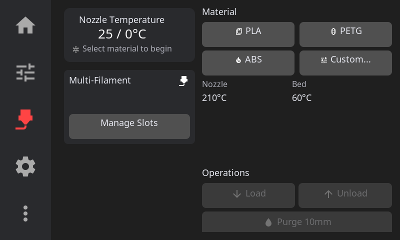
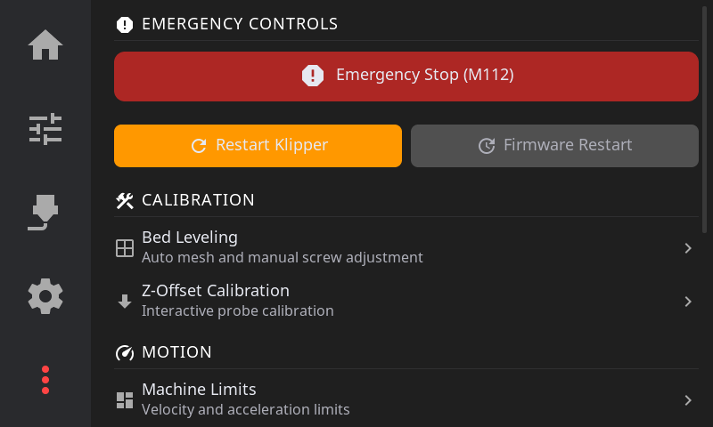

# HelixScreen User Guide

Complete guide to using HelixScreen, the touchscreen UI for Klipper 3D printers.

---

## Table of Contents

- [Introduction](#introduction)
  - [Quick Reference](#quick-reference)
  - [Navigation Basics](#navigation-basics)
  - [Connection Status](#connection-status)
- [First-Time Setup](#first-time-setup)
  - [Setup Wizard Overview](#setup-wizard-overview)
  - [WiFi Configuration](#wifi-configuration)
  - [Printer Connection](#printer-connection)
  - [Hardware Discovery](#hardware-discovery)
  - [Touch Calibration](#touch-calibration)
- [Touch Screen Basics](#touch-screen-basics)
- [Home Panel](#home-panel)
  - [Status Area](#status-area)
  - [Temperature Displays](#temperature-displays)
  - [AMS/Filament Status](#amsfilament-status)
  - [Quick Actions](#quick-actions)
- [Printing Workflow](#printing-workflow)
  - [Selecting a File](#selecting-a-file)
  - [File Preview](#file-preview)
  - [Pre-Print Options](#pre-print-options)
  - [Starting a Print](#starting-a-print)
  - [During a Print](#during-a-print)
  - [Print Tune Overlay](#print-tune-overlay)
  - [Z-Offset / Baby Steps](#z-offset--baby-steps)
  - [Pressure Advance Tuning](#pressure-advance-tuning)
  - [Exclude Object](#exclude-object)
  - [After a Print](#after-a-print)
- [Temperature Control](#temperature-control)
  - [Nozzle Temperature Panel](#nozzle-temperature-panel)
  - [Bed Temperature Panel](#bed-temperature-panel)
  - [Temperature Presets](#temperature-presets)
  - [Temperature Graphs](#temperature-graphs)
- [Motion & Positioning](#motion--positioning)
  - [Motion Panel](#motion-panel)
  - [Homing](#homing)
  - [Distance Increments](#distance-increments)
  - [Emergency Stop](#emergency-stop)
- [Filament Management](#filament-management)
  - [Extrusion Panel](#extrusion-panel)
  - [Load/Unload Filament](#loadunload-filament)
  - [Filament Panel (AMS)](#filament-panel-ams)
  - [Spoolman Integration](#spoolman-integration)
  - [Dryer Control](#dryer-control)
- [Calibration & Tuning](#calibration--tuning)
  - [Bed Mesh](#bed-mesh)
  - [Screws Tilt Adjust](#screws-tilt-adjust)
  - [Input Shaper](#input-shaper)
  - [Z-Offset Calibration](#z-offset-calibration)
  - [PID Tuning](#pid-tuning)
- [Settings](#settings)
  - [Display Settings](#display-settings)
  - [Theme Settings](#theme-settings)
  - [Sound Settings](#sound-settings)
  - [Network Settings](#network-settings)
  - [Sensor Settings](#sensor-settings)
  - [Touch Calibration](#touch-calibration-settings)
  - [Hardware Health](#hardware-health)
  - [Safety Settings](#safety-settings)
  - [Machine Limits](#machine-limits)
  - [Factory Reset](#factory-reset)
- [Advanced Features](#advanced-features)
  - [Console](#console)
  - [Macro Execution](#macro-execution)
  - [Power Device Control](#power-device-control)
  - [Print History](#print-history)
  - [Notification History](#notification-history)
  - [Timelapse Settings](#timelapse-settings)
- [Keyboard & Input](#keyboard--input)
  - [On-Screen Keyboard](#on-screen-keyboard)
  - [Touch Gestures](#touch-gestures)
  - [Simulator Shortcuts](#simulator-shortcuts)
- [Beta Features](#beta-features)
  - [Enabling Beta Features](#enabling-beta-features)
  - [Beta Feature List](#beta-feature-list)
  - [Update Channel Selection](#update-channel-selection)
- [Tips & Best Practices](#tips--best-practices)
  - [Workflow Tips](#workflow-tips)
  - [Quick Troubleshooting](#quick-troubleshooting)
  - [When to Use Which Panel](#when-to-use-which-panel)

---

## Introduction

HelixScreen is a modern touchscreen interface for Klipper 3D printers. It connects to your printer via Moonraker and provides intuitive controls for printing, temperature management, calibration, and more.

### Quick Reference

| Sidebar Icon | Panel | What You'll Do There |
|--------------|-------|----------------------|
| 🏠 Home | Home | Monitor status, start prints, view temperatures |
| 🎚 Tune | Controls | Move axes, set temperatures, control fans |
| 🧵 Spool | Filament | Load/unload filament, manage AMS slots |
| ⚙️ Gear | Settings | Configure display, sound, network, sensors |
| ⋯ More | Advanced | Calibration, history, macros, system tools |

### Navigation Basics

HelixScreen uses a consistent layout:

- **Left sidebar**: Five navigation buttons to switch between main panels
- **Back arrow**: Returns from sub-panels to the parent panel
- **Tap**: Select buttons, open panels, activate controls
- **Swipe**: Scroll through lists and long content

> **Note:** The Print Select panel is accessed by tapping the print area on the Home panel, not from the sidebar. The Controls and Filament panels require an active printer connection.

### Connection Status

The Home panel shows your printer connection status:

| Indicator | Meaning |
|-----------|---------|
| Green checkmark | Connected and ready |
| Red X | Disconnected (auto-reconnect in progress) |
| Yellow exclamation | Klipper not ready (firmware restart needed) |

When disconnected, a toast notification appears and HelixScreen attempts to reconnect automatically every few seconds.

---

## First-Time Setup

When you first start HelixScreen, the Setup Wizard guides you through initial configuration.

### Setup Wizard Overview

The wizard walks you through these steps:

1. **Language selection** - Choose your interface language
2. **WiFi configuration** - Connect to your wireless network (if needed)
3. **Printer connection** - Enter your Moonraker address
4. **Hardware discovery** - Identify heaters, fans, sensors, and LEDs
5. **Touch calibration** - Calibrate your touchscreen (if applicable)
6. **Summary** - Review your configuration

You can re-run the wizard anytime via **Settings > Factory Reset**.

### WiFi Configuration

If your device needs WiFi:

1. Available networks appear in a list
2. Tap a network to select it
3. Enter the password using the on-screen keyboard
4. Tap **Connect** and wait for confirmation

The wizard shows signal strength for each network and indicates which one you're currently connected to.

### Printer Connection

Enter your Moonraker connection details:

- **Hostname or IP**: Your printer's address (e.g., `voron.local` or `192.168.1.100`)
- **Port**: Usually `7125` (the default)
- **API Key**: Only needed if Moonraker requires authentication

HelixScreen auto-discovers printers on your network when possible. Tap a discovered printer to auto-fill the connection details.

### Hardware Discovery

HelixScreen scans your Klipper configuration and identifies:

- **Heaters**: Hotend, bed, chamber (if present)
- **Fans**: Part cooling, hotend, auxiliary fans
- **Sensors**: Filament runout, probes, accelerometers
- **LEDs**: Chamber lights, status LEDs
- **AMS**: Multi-material systems (Happy Hare, AFC-Klipper)

For each category, confirm which hardware should be monitored and controlled. You can adjust these later in **Settings > Sensors** and **Settings > Hardware Health**.

### Touch Calibration

On touchscreen displays, you'll be prompted to tap calibration targets:

1. Tap each crosshair target as it appears (usually 4-5 points)
2. Tap as close to the center of each target as possible
3. Calibration saves automatically when complete

If your touchscreen feels inaccurate later, recalibrate via **Settings > Touch Calibration**.

---

## Touch Screen Basics

HelixScreen supports these touch interactions:

| Gesture | Action |
|---------|--------|
| **Tap** | Select buttons, open panels, toggle options |
| **Swipe** | Scroll lists, move through content |
| **Long press** | Access alternate characters on keyboard |
| **Pinch/spread** | Zoom 3D views (G-code preview, bed mesh) |

Temperature displays are tappable shortcuts—tap the nozzle or bed temperature on the Home panel to jump directly to that temperature control panel.

---

## Home Panel

The Home Panel is your printer dashboard showing status at a glance.

### Status Area

The top area displays:

- **Printer state**: Idle, Printing, Paused, Complete, Error
- **Print progress**: Percentage and time remaining (when printing)
- **Current filename**: What's being printed
- **Connection indicator**: Your link to Moonraker/Klipper

### Temperature Displays

Real-time temperature readouts show:

- **Nozzle**: Current / Target temperature
- **Bed**: Current / Target temperature
- **Chamber**: Current temperature (if equipped)

**Tap any temperature** to jump directly to its control panel.

### AMS/Filament Status

If you have a multi-material system (Happy Hare, AFC-Klipper, Bambu AMS):

- Visual display of loaded filament slots
- Current active slot highlighted
- Color indicators from Spoolman (if integrated)
- Tap to access the Filament panel

### Quick Actions

Buttons for common operations:

- **LED Toggle**: Turn chamber/printer lights on/off
- **Emergency Stop**: Halt all motion immediately (confirmation required unless disabled in Safety Settings)

---

## Printing Workflow

### Selecting a File

1. From the **Home panel**, tap the print file area (shows "Select a file" when idle)
2. Browse your G-code files from Moonraker's virtual SD card

**View options:**

- **Card View** (default): Thumbnails with file info—estimated time, filament usage, slicer
- **List View**: Compact view for browsing many files (toggle with the view button in top-right)

**Sorting options** (tap the sort button):

- Name (A-Z or Z-A)
- Modified date (newest or oldest first)
- Size (largest or smallest)
- Print time (longest or shortest)

### File Preview

Tap a file to see the preview panel:

- **3D G-code preview**: Rotatable with touch, showing the toolpath
- **Layer slider**: Scrub through layers to inspect the print
- **Metadata**: File size, estimated time, filament usage, slicer used
- **Thumbnail**: Embedded preview image (if your slicer generates one)

### Pre-Print Options

Before starting, you can enable or disable:

| Option | What It Does |
|--------|--------------|
| Auto bed level | Run bed mesh calibration before print |
| Quad gantry level | Run QGL calibration (for gantry printers) |
| Z-tilt adjust | Run Z-tilt calibration |
| Nozzle clean | Execute your cleaning macro |

These options modify the G-code on-the-fly—if you disable "Auto bed level" but your G-code contains `BED_MESH_CALIBRATE`, HelixScreen comments it out so it doesn't run.

> **Tip:** Pre-print options remember your preferences per slicer. If you always run bed mesh before PrusaSlicer prints, that preference persists.

### Starting a Print

1. Select your file
2. Review and set pre-print options
3. Tap **Start Print**

The UI switches to the Print Status panel automatically.

### During a Print

The Print Status panel shows:

- **Circular progress indicator** with percentage
- **Time elapsed** and **time remaining**
- **Current layer** / total layers
- **Filename** and thumbnail

**Print controls:**

| Button | Action |
|--------|--------|
| **Pause** | Parks nozzle safely, pauses print |
| **Resume** | Continues from paused state |
| **Cancel** | Stops print (confirmation required) |
| **Tune** | Opens Print Tune overlay for real-time adjustments |

### Print Tune Overlay

Access by tapping **Tune** during an active print.

| Parameter | Range | What It Does |
|-----------|-------|--------------|
| Speed % | 10-300% | Overall print speed multiplier |
| Flow % | 75-125% | Extrusion rate multiplier |
| Fan % | 0-100% | Part cooling fan speed |

**When to adjust:**

- **Speed %**: Slow down (50-70%) for intricate details or if you see layer separation. Speed up for large infill areas.
- **Flow %**: Increase (105-110%) if you see gaps between extrusion lines. Decrease (95-98%) for blobs or over-packed lines.
- **Fan %**: Increase for better bridging and overhangs. Decrease or disable for ABS/ASA to prevent warping.

> **Note:** Tune adjustments are temporary and only affect the current print. The next print uses your slicer's original values.

### Z-Offset / Baby Steps

Fine-tune your first layer height while printing:

**Adjustment increments:**

- **-0.05mm / -0.01mm**: Nozzle closer to bed (more squish)
- **+0.01mm / +0.05mm**: Nozzle further from bed (less squish)

**Signs you need to adjust:**

| Symptom | Problem | Fix |
|---------|---------|-----|
| Lines not sticking, curling up | Nozzle too high | Tap **-0.01** or **-0.05** |
| Rough first layer, scratching sounds | Nozzle too low | Tap **+0.01** or **+0.05** |
| Gaps between lines | Nozzle too high | Tap **-0.01** |
| Elephant foot, ridges | Nozzle too low | Tap **+0.01** or **+0.05** |

**Saving your Z-Offset:**

1. Get the first layer looking good
2. Tap **Save Z-Offset** to write to Klipper config
3. Future prints use this as the starting point

> **Tip:** Make small adjustments (0.01mm) and wait for the printer to complete a few moves before judging the result.

### Pressure Advance Tuning

If your printer has Pressure Advance configured:

1. Tap **Tune** during a print
2. Find **Pressure Advance** section (only visible if PA is enabled in Klipper)
3. Adjust the value

**Typical values by material:**

| Material | PA Range |
|----------|----------|
| PLA | 0.02 - 0.06 |
| PETG | 0.04 - 0.10 |
| ABS/ASA | 0.03 - 0.08 |
| TPU | 0.10 - 0.20 |

**When to adjust:**

- **Bulging corners**: Increase PA by 0.01-0.02
- **Gaps at line starts**: Decrease PA by 0.01-0.02

### Exclude Object

If your slicer supports object labels (OrcaSlicer, SuperSlicer):

1. Tap **Exclude Object** during a print
2. See a list of printable objects
3. Select an object to skip (e.g., a failed part)
4. **Undo** is available for 5 seconds after exclusion

This lets you salvage a print when one object fails without canceling the entire job.

### After a Print

When a print completes:

- Status shows **Complete** with total time
- Notification sound plays (if enabled)
- Print is logged to history

---

## Temperature Control

### Nozzle Temperature Panel

- **Current temperature**: Live reading from thermistor
- **Target input**: Tap to enter exact temperature
- **Presets**: Quick buttons for common temperatures
- **Temperature graph**: History over time

### Bed Temperature Panel

Same layout as nozzle control:

- Current and target temperature
- Presets for common materials
- Temperature graph

### Temperature Presets

Built-in presets:

| Material | Nozzle | Bed |
|----------|--------|-----|
| Off | 0°C | 0°C |
| PLA | 210°C | 60°C |
| PETG | 240°C | 80°C |
| ABS | 250°C | 100°C |

Tap a preset to set both current and target. Custom presets can be configured via Klipper macros.

### Temperature Graphs

Live graphs show:

- **Current temperature** (solid line)
- **Target temperature** (dashed line)
- **History** scrolling over time

Useful for diagnosing heating issues or verifying PID tuning.

---

## Motion & Positioning

### Motion Panel

**Jog Pad:**

- **X/Y crosshair**: Tap directions to move print head horizontally
- **Z buttons**: Up/down arrows for vertical movement
- **Position display**: Shows current X, Y, Z coordinates

### Homing

| Button | Action |
|--------|--------|
| **Home All** | Homes X, Y, and Z axes |
| **Home XY** | Homes only X and Y |
| **Home Z** | Homes only Z (requires X/Y homed first on most printers) |

### Distance Increments

Select movement distance per button press:

- **0.1mm**: Fine positioning
- **1mm**: Standard adjustments
- **10mm**: Moderate moves
- **100mm**: Large repositioning

Smaller increments give more control but require more taps.

### Emergency Stop

The E-Stop button halts all printer motion immediately. By default, requires confirmation to prevent accidental presses. This can be configured in **Settings > Safety**.

---

## Filament Management

### Extrusion Panel

Manual filament control:

| Button | Action |
|--------|--------|
| **Extrude** | Push filament through nozzle |
| **Retract** | Pull filament back |

**Amount selector**: 5mm, 10mm, 25mm, 50mm
**Speed selector**: Slow, Normal, Fast

> **Safety:** Extrusion requires the hotend to be at minimum temperature (usually 180°C for PLA, higher for other materials).

### Load/Unload Filament

**To load filament:**

1. Heat the nozzle to appropriate temperature
2. Insert filament into extruder
3. Use **Extrude** button (10-25mm increments) until filament flows cleanly

**To unload filament:**

1. Heat the nozzle
2. Use **Retract** button repeatedly until filament clears the extruder

### Filament Panel (AMS)

For multi-material systems (Happy Hare, AFC-Klipper):

**Slot Status:**

- Visual display of all slots (typically 4-8)
- Color indicators for loaded filament
- Active slot highlighted with border
- Empty slots shown as gray

**Controls:**

- **Load**: Feed filament from selected slot to toolhead
- **Unload**: Retract filament back to buffer
- **Home**: Run homing sequence for the AMS

Tap a slot to select it before load/unload operations.

### Spoolman Integration

When Spoolman is configured:

- Spool name and material type displayed per slot
- Remaining filament weight shown
- Tap a slot to open **Spool Picker** and assign a different spool

### Dryer Control

If your AMS has an integrated dryer:

- Temperature display and control
- Timer settings
- Enable/disable drying cycle

---

## Calibration & Tuning

### Bed Mesh

3D visualization of your bed surface:

- **Color gradient**: Blue (low) to Red (high)
- **Touch to rotate** the 3D view
- **Mesh profile selector**: Switch between saved meshes

**Actions:**

| Button | What It Does |
|--------|--------------|
| **Calibrate** | Run new mesh probing |
| **Clear** | Remove current mesh from memory |
| **Load** | Load a saved mesh profile |

The visualization mode (3D, 2D, or Auto) can be changed in **Settings > Display**.

### Screws Tilt Adjust

Assisted manual bed leveling:

1. Navigate to **Advanced > Screws Tilt**
2. Tap **Measure** to probe all bed screw positions
3. View adjustment amounts (e.g., "CW 00:15" = clockwise 15 minutes)
4. Adjust screws and re-measure until level

**Color coding:**

- **Green**: Level (within tolerance)
- **Yellow**: Minor adjustment needed
- **Red**: Significant adjustment needed

### Input Shaper

Tune vibration compensation for smoother, faster prints:

1. Navigate to **Advanced > Input Shaper**
2. Select axis to test (X or Y)
3. Tap **Measure** to run resonance test
4. Review recommended shaper type and frequency
5. Tap **Apply** to save to configuration

The panel shows frequency graphs from the resonance test and current shaper settings.

> **Requirement:** Accelerometer must be configured in Klipper for measurements.

### Z-Offset Calibration

Dedicated panel for dialing in your Z-offset when not printing:

1. Navigate to **Advanced > Z-Offset**
2. Home the printer
3. Use adjustment buttons to set the gap
4. Paper test: adjust until paper drags slightly
5. Tap **Save** to write to Klipper config

### PID Tuning

Calibrate temperature controllers:

1. Navigate to **Controls > PID**
2. Select **Nozzle** or **Bed**
3. Enter target temperature
4. Tap **Start** to run automatic tuning
5. Review results and tap **Save** to write to config

PID tuning takes several minutes as the heater cycles through temperature swings.

---

## Settings

Access via the **Gear icon** in the navigation bar.

### Display Settings

| Setting | Options |
|---------|---------|
| **Brightness** | 0-100% backlight level |
| **Dim timeout** | When screen dims (30s, 1m, 2m, 5m, Never) |
| **Sleep timeout** | When screen turns off (1m, 2m, 5m, 10m, Never) |
| **Time format** | 12-hour or 24-hour clock |
| **Bed mesh render** | Auto, 3D, or 2D visualization |

### Theme Settings

1. Tap **Theme** to open the theme explorer
2. Browse available themes (built-in and custom)
3. Toggle dark/light mode to preview
4. Tap **Apply** to use a theme (restart may be required)
5. Tap **Edit** to customize colors in the theme editor

### Sound Settings

| Setting | Options |
|---------|---------|
| **Enable sounds** | Toggle all sound effects on/off |
| **Test beep** | Play a test tone (M300 command) |
| **Completion alert** | How to notify when prints finish (Off, Notification, Alert) |

### Network Settings

- **WiFi**: Connect to wireless networks, view signal strength
- **Moonraker**: Change printer connection address and port

### Sensor Settings

Manage all printer sensors:

**Filament sensors** - Choose the role for each:

| Role | Behavior |
|------|----------|
| **Runout** | Pauses print when filament runs out |
| **Motion** | Detects filament movement (clog detection) |
| **Ignore** | Sensor present but not monitored |

**Other sensors** - View detected hardware:

- Accelerometers (for Input Shaper)
- Probe sensors (BLTouch, eddy current, etc.)
- Humidity, width, color sensors

### Touch Calibration Settings

> **Note:** This option only appears on touchscreen displays, not in the desktop simulator.

Recalibrate if taps register in the wrong location:

1. Tap **Touch Calibration** in Settings
2. Tap each crosshair target as it appears
3. Calibration saves automatically

The settings row shows "Calibrated" or "Not calibrated" status.

### Hardware Health

View detected hardware issues:

| Category | Meaning |
|----------|---------|
| **Critical** | Required hardware missing |
| **Warning** | Expected hardware not found |
| **Info** | Newly discovered hardware |
| **Session** | Hardware changed since last session |

**Actions for non-critical issues:**

- **Ignore**: Mark as optional (won't warn again)
- **Save**: Add to expected list (will warn if removed later)

Use this when adding or removing hardware to keep HelixScreen's expectations accurate.

### Safety Settings

| Setting | Description |
|---------|-------------|
| **E-Stop confirmation** | Require tap-and-hold before emergency stop |

### Machine Limits

Adjust motion limits for the current session:

- Maximum velocity per axis
- Maximum acceleration per axis
- Maximum jerk per axis

These override your Klipper config temporarily—useful for testing or troubleshooting motion issues.

### Factory Reset

Clears all HelixScreen settings and restarts the Setup Wizard. Does not affect Klipper configuration.

---

## Advanced Features

Access via the **More (⋯)** icon in the navigation bar.

### Console

View G-code command history and Klipper responses:

1. Navigate to **Controls > Console** (or **Advanced > Console**)
2. Scroll through recent commands

**Color coding:**

- **White**: Commands sent
- **Green**: Successful responses
- **Red**: Errors and warnings

### Macro Execution

Execute custom Klipper macros:

1. Navigate to **Controls > Macros** or **Advanced > Macros**
2. Browse available macros (alphabetically sorted)
3. Tap a macro to execute

**Notes:**

- System macros (starting with `_`) are hidden by default
- Names are prettified: `CLEAN_NOZZLE` → "Clean Nozzle"
- Dangerous macros (`SAVE_CONFIG`, etc.) require confirmation

### Power Device Control

Control Moonraker power devices:

1. Navigate to **Controls > Power**
2. Toggle devices on/off with switches

**Notes:**

- Devices may be locked during prints (safety feature)
- Lock icon indicates protected devices

### Print History

View past print jobs:

**Dashboard view:**

- Total prints, success rate
- Print time and filament usage statistics
- Trend graphs over time

**List view:**

- Search by filename
- Filter by status (completed, failed, cancelled)
- Sort by date, duration, or name

**Detail view:**

- Tap any job for full details
- **Reprint**: Start the same file again
- **Delete**: Remove from history

### Notification History

Review past system notifications:

1. Tap the **bell icon** in the status bar
2. Scroll through history
3. Tap **Clear All** to dismiss

**Color coding:**

- Blue: Info
- Yellow: Warning
- Red: Error

### Timelapse Settings

Configure Moonraker-Timelapse:

1. Navigate to **Advanced > Timelapse**
2. Enable/disable timelapse recording
3. Select mode:
   - **Layer Macro**: Snapshot at each layer
   - **Hyperlapse**: Time-based snapshots
4. Set framerate (15/24/30/60 fps)
5. Enable auto-render for automatic video creation

---

## Keyboard & Input

### On-Screen Keyboard

The keyboard appears automatically for text input:

- **QWERTY layout** with number row
- **Long-press** for alternate characters (hold 'a' for '@', etc.)
- **?123 button**: Switch to symbols
- **ABC button**: Switch to letters
- **Shift**: Toggle uppercase

### Touch Gestures

| Gesture | Action |
|---------|--------|
| Tap | Select, activate |
| Swipe | Scroll content |
| Long press | Alternate characters (keyboard) |
| Pinch/spread | Zoom 3D views |

### Simulator Shortcuts

When using the SDL2 desktop simulator:

| Key | Action |
|-----|--------|
| **S** | Take screenshot (saves to /tmp/) |
| **Escape** | Exit application |

---

## Beta Features

HelixScreen includes several features that are functional but still being refined. These are gated behind a beta flag so they can be tested without affecting the default experience.

### Enabling Beta Features

**Method 1: Secret tap (recommended)**
1. Go to **Settings > About**
2. Tap the **Current Version** button **7 times** (like enabling Android Developer Mode)
3. A countdown appears after 4 taps ("3 more taps...", "2 more taps...", etc.)
4. A toast confirms "Beta features: ON"

Repeat the same process to disable beta features.

> **Note:** Taps must be within 2 seconds of each other or the counter resets.

**Method 2: Config file**
Set `"beta_features": true` in your `helixconfig.json`.

**Method 3: Test mode**
Beta features are always enabled when running with `--test`.

### Beta Feature List

When beta features are enabled, the following appear in the UI with an orange "BETA" badge and left accent border:

| Feature | Location | Description | Status |
|---------|----------|-------------|--------|
| **Input Shaping** | Advanced panel | Resonance compensation tuning via accelerometer | Functional; requires accelerometer hardware |
| **Z-Offset Calibration** | Advanced panel | Interactive probe-based Z calibration | Functional; requires probe (BLTouch, etc.) |
| **HelixPrint Plugin** | Advanced panel | Install/uninstall the HelixPrint Klipper plugin for advanced print start control | Functional; plugin manages bed mesh, QGL, z-tilt skipping |
| **Configure PRINT_START** | Advanced panel | Make bed mesh and QGL skippable in your print start macro | Functional; requires HelixPrint plugin installed |
| **Timelapse** | Advanced panel | Configure Moonraker-Timelapse recording settings | Functional; requires timelapse plugin or webcam |
| **Timelapse Setup** | Advanced panel | Install the timelapse plugin (shown when not installed but webcam detected) | Functional |
| **Plugins** | Settings panel | View installed plugins and their status | Functional; plugin system is early-stage |
| **Update Channel** | Settings panel | Switch between Stable, Beta, and Dev update channels | Functional; Beta/Dev channels may have less-tested releases |
| **Macro Browser** | Advanced panel | Browse and execute custom Klipper macros | Functional; hides system macros, confirms dangerous ones |
| **Z Calibration** | Controls panel | Quick-access Z calibration button | Functional; requires probe hardware |

### Update Channel Selection

When beta features are enabled, a channel selector appears in **Settings > About**:

| Channel | Description |
|---------|-------------|
| **Stable** | Production releases (default) |
| **Beta** | Pre-release builds for testing upcoming features |
| **Dev** | Development builds — latest code, may be unstable |

The update channel can also be set via `update.channel` in the config file (0=Stable, 1=Beta, 2=Dev).

---

## Tips & Best Practices

### Workflow Tips

**Temperature shortcuts**: Tap temperature displays on the Home panel to jump directly to temperature controls.

**Pre-print options**: These remember your choices per slicer—if you always mesh before PrusaSlicer prints, it persists.

**Quick homing**: Use "Home All" before starting manual positioning to ensure known coordinates.

**Save Z-offset during first layer**: Make baby step adjustments, then save while you can see the results.

### Quick Troubleshooting

| Problem | Quick Fix |
|---------|-----------|
| Touchscreen taps in wrong spot | **Settings > Touch Calibration** |
| Panel shows "Disconnected" | Check Moonraker is running, network is up |
| Temperature not changing | Verify heater is enabled in Klipper config |
| Can't extrude | Heat nozzle above minimum temp first |
| AMS not showing | Check Happy Hare/AFC is configured in Klipper |

For detailed troubleshooting, see [TROUBLESHOOTING.md](TROUBLESHOOTING.md).

### When to Use Which Panel

| I want to... | Go to... |
|--------------|----------|
| Start a print | Home panel → tap print area |
| Change nozzle temp | Home panel → tap nozzle temp (or Controls) |
| Move print head | Controls → Motion |
| Load filament | Controls → Extrusion (single) or Filament (AMS) |
| Level my bed | Advanced → Screws Tilt |
| Run a custom macro | Advanced → Macros |
| Check print history | Advanced → History |
| Change theme | Settings → Theme |
| Fix touch calibration | Settings → Touch Calibration |

---

## Further Reading

- [TROUBLESHOOTING.md](TROUBLESHOOTING.md) - Solutions to common problems
- [CONFIGURATION.md](CONFIGURATION.md) - Detailed configuration options
- [FAQ.md](FAQ.md) - Frequently asked questions
- [INSTALL.md](INSTALL.md) - Installation instructions

---

*HelixScreen - Making Klipper accessible through touch*
