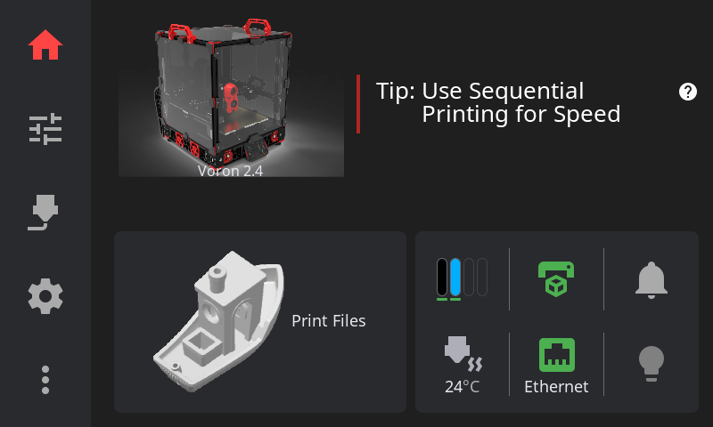

# Home Panel

The Home Panel is your printer dashboard — showing status at a glance.

---

## Status Area

The top area displays:

- **Printer state**: Idle, Printing, Paused, Complete, Error
- **Print progress**: Percentage and time remaining (when printing)
- **Current filename**: What's being printed
- **Connection indicator**: Your link to Moonraker/Klipper

---

## Home Widgets

Below the status area, the Home Panel displays a row of **configurable widgets** — quick-access buttons for the features you use most. You choose which widgets appear, and in what order.

### Available Widgets

| Widget | What It Does |
|--------|-------------|
| **Power** | Toggle Moonraker power devices. Only appears if you have power devices configured. |
| **Network** | Shows WiFi signal strength or Ethernet status at a glance. |
| **Firmware Restart** | Restart Klipper firmware with one tap. Always shown when Klipper is in SHUTDOWN state, even if disabled. |
| **AMS Status** | Mini view of your multi-material spool slots. Only appears if an AMS/MMU system is detected. |
| **Temperature** | Nozzle temperature readout with animated heating icon. Tap to open the Temperature panel. |
| **LED Light** | Quick toggle for your LEDs. Long-press for the full LED Control Overlay (see [LED Controls](#led-controls) below). |
| **Humidity** | Enclosure humidity sensor reading. Only appears if a humidity sensor is detected. |
| **Width Sensor** | Filament width sensor reading. Only appears if a width sensor is detected. |
| **Probe** | Z probe status and offset. Only appears if a probe is configured. |
| **Filament Sensor** | Filament runout detection status. Only appears if a filament sensor is detected. |
| **Notifications** | Pending alerts with severity badge. Tap to open notification history. |

Up to **10 widgets** can be enabled at once. They automatically arrange into 1 or 2 rows depending on how many are active.

### Hardware-Gated Widgets

Some widgets only appear when the relevant hardware is detected by Klipper. If a sensor, probe, or AMS system isn't present, that widget is automatically hidden on the Home Panel — even if enabled in settings. In the widget configuration screen, these show "(not detected)" and their toggle is disabled.

### Customizing Widgets

To change which widgets appear and their order:

1. Go to **Settings** → **Home Widgets** (in the Appearance section)
2. **Toggle** widgets on or off with the switch on each row
3. **Reorder** by long-pressing the drag handle (arrows icon) on a row and dragging it to a new position
4. Changes take effect immediately when you leave the overlay

To reset to defaults, disable all widgets and re-enable the ones you want, or edit the config file directly (see [Configuration Reference](../CONFIGURATION.md#home-widget-settings)).

---

## Active Tool Badge

On printers with a toolchanger, the Home Panel displays an active tool badge:

- Shows the current active tool (e.g. "T0", "T1")
- Updates automatically when tools are switched during a print or via macros
- Only visible on multi-tool printers — single-extruder printers will not see this badge

---

## Emergency Stop

The **Emergency Stop** button halts all motion immediately (confirmation required unless disabled in Safety Settings).

---

## LED Controls

Long-pressing the LED button opens the LED Control Overlay — a full control panel for all your printer's lighting. What you see depends on your hardware.

### Strip Selector

If you have more than one LED strip configured, a row of chips lets you pick which strip to control. The overlay heading updates to show the selected strip name.

### Color & Brightness (Klipper Native LEDs)

For neopixel, dotstar, and other Klipper-native strips:

- **Color presets**: Tap one of the 8 preset swatches (White, Warm, Orange, Blue, Red, Green, Purple, Cyan)
- **Custom color**: Tap the custom color button to open an HSV color picker — pick any color and it automatically separates into a base color and brightness level
- **Brightness slider**: Adjust from 0–100%, independent of color
- **Color swatch**: Shows the actual output color (base color adjusted by brightness)
- **Turn Off**: Stops any active effects and turns off the selected strip

> **Note:** Strips that don't support color (like single-channel PWM LEDs) show brightness controls only.

### LED Effects

If you have the [klipper-led_effect](https://github.com/julianschill/klipper-led_effect) plugin installed, an effects section appears with cards for each available effect. Effects are filtered to show only those that target the currently selected strip. The active effect is highlighted, and a **Stop All Effects** button lets you kill all running effects at once.

### WLED Controls

For WLED network strips:

- **On/Off toggle**: Turn the WLED strip on or off
- **Brightness slider**: 0–100%
- **Presets**: Buttons for each WLED preset — fetched directly from your WLED device, with the active preset highlighted

### Macro Device Controls

Custom macro devices you've configured in [LED Settings](settings.md#led-settings) appear here with controls matching their type:

- **On/Off devices**: Separate "Turn On" and "Turn Off" buttons
- **Toggle devices**: A single "Toggle" button
- **Preset devices**: Named buttons for each preset action

---

## Printer Manager

**Tap the printer image** on the Home Panel to open the Printer Manager overlay. This is your central place to view and customize your printer's identity.

### Printer Identity Card

The top of the overlay displays an identity card with your printer image, name, and model. From here you can:

- **Change the printer image**: Tap the printer image (marked with a pencil badge) to open the Printer Image picker overlay. You can choose from:
  - **Auto-Detect** (default) — HelixScreen selects an image based on your printer type reported by Klipper
  - **Shipped Images** — Over 25 pre-rendered images covering Voron, Creality, FlashForge, Anycubic, RatRig, FLSUN, and more
  - **Custom Images** — Your own PNG or JPEG files (see below)

  The picker shows a list on the left and a live preview on the right. Your selection persists across restarts.

- **Edit the printer name**: Tap the printer name (shown with a pencil icon) to enable inline editing. Type the new name, press **Enter** to save, or **Escape** to cancel.

### Software Versions

Below the identity card, the overlay displays current software versions for Klipper, Moonraker, and HelixScreen.

### Hardware Capabilities

A row of chips shows detected hardware capabilities: Probe, Bed Mesh, Heated Bed, LEDs, ADXL, QGL, Z-Tilt, and others depending on your Klipper configuration.

### Adding Custom Printer Images

To use your own printer image:

1. Place a PNG or JPEG file into `config/custom_images/` in your HelixScreen installation directory
2. Open the Printer Image picker from the Printer Manager
3. Your custom images appear automatically — HelixScreen converts them to optimized LVGL binary format on first load

**Custom image requirements:** PNG or JPEG, maximum 5MB file size, maximum 2048x2048 pixels. HelixScreen generates optimized 300px and 150px variants automatically.

---

**Next:** [Printing](printing.md) | **Prev:** [Getting Started](getting-started.md) | [Back to User Guide](../USER_GUIDE.md)
