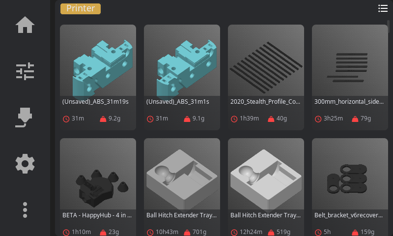

# Printing

Everything about selecting, starting, monitoring, and tuning your prints.

---

## Selecting a File

1. From the **Home panel**, tap the print file area (shows "Select a file" when idle)
2. Browse your G-code files from Moonraker's virtual SD card

**View options:**

- **Card View** (default): Thumbnails with file info — estimated time, filament usage, slicer
- **List View**: Compact view for browsing many files (toggle with the grid icon in top-right)

List view shows filename, print status, file size, modification date, and estimated print time in a sortable table. Tap any column header to sort.

**Sorting options** (tap the sort button):

- Name (A-Z or Z-A)
- Modified date (newest or oldest first)
- Size (largest or smallest)
- Print time (longest or shortest)

---

## File Preview

Tap a file to see the preview panel:

- **3D G-code preview**: Rotatable with touch, showing the toolpath
- **Metadata**: Estimated time, filament weight, layer count, material, and layer height
- **Pre-print steps**: Shows which calibration steps will run before printing (e.g., bed mesh)
- **Timelapse toggle**: Enable recording if you have the timelapse plugin installed

---

## Pre-Print Options

Before starting, you can enable or disable:

| Option | What It Does |
|--------|--------------|
| Auto bed level | Run bed mesh calibration before print |
| Quad gantry level | Run QGL calibration (for gantry printers) |
| Z-tilt adjust | Run Z-tilt calibration |
| Nozzle clean | Execute your cleaning macro |

These options modify the G-code on-the-fly — if you disable "Auto bed level" but your G-code contains `BED_MESH_CALIBRATE`, HelixScreen comments it out so it doesn't run.

> **Tip:** Pre-print options remember your preferences per slicer. If you always run bed mesh before PrusaSlicer prints, that preference persists.

---

## Starting a Print

1. Select your file
2. Review and set pre-print options
3. Tap **Start Print**

The UI switches to the Print Status panel automatically.

---

## During a Print

The Print Status panel shows:

- **Circular progress indicator** with percentage
- **Time elapsed** and **time remaining**
- **Current layer** / total layers
- **Filament used** — live consumption updated during printing
- **Filename** and thumbnail

**Print controls:**

| Button | Action |
|--------|--------|
| **Pause** | Parks nozzle safely, pauses print |
| **Resume** | Continues from paused state |
| **Cancel** | Stops print (confirmation required). By default, waits for the printer's cancel routine to finish. If **Cancel Escalation** is enabled in **Settings > Safety**, an emergency stop triggers automatically after the configured timeout. |
| **Tune** | Opens Print Tune overlay for real-time adjustments |

### Timelapse Toggle

If the Moonraker-Timelapse plugin is installed, a **timelapse button** appears in the print controls. Tap it to enable or disable recording for the current print. The button shows a camera icon and toggles between "On" and "Off" states.

During printing, frame captures happen automatically based on your timelapse settings (per-layer or time-based). When the print finishes, the video renders automatically if auto-render is enabled.

---

## Print Tune Overlay

Access by tapping **Tune** during an active print.

| Parameter | Range | What It Does |
|-----------|-------|--------------|
| Speed % | 10-300% | Overall print speed multiplier |
| Flow % | 75-125% | Extrusion rate multiplier |
| Fan % | 0-100% | Part cooling fan speed |

**When to adjust:**

- **Speed %**: Slow down (50-70%) for intricate details or if you see layer separation. Speed up for large infill areas.
- **Flow %**: Increase (105-110%) if you see gaps between extrusion lines. Decrease (95-98%) for blobs or over-packed lines.
- **Fan %**: Increase for better bridging and overhangs. Decrease or disable for ABS/ASA to prevent warping.

> **Note:** Tune adjustments are temporary and only affect the current print. The next print uses your slicer's original values.

---

## Z-Offset / Baby Steps

Fine-tune your first layer height while printing:

**Adjustment increments:**

- **-0.05mm / -0.01mm**: Nozzle closer to bed (more squish)
- **+0.01mm / +0.05mm**: Nozzle further from bed (less squish)

**Signs you need to adjust:**

| Symptom | Problem | Fix |
|---------|---------|-----|
| Lines not sticking, curling up | Nozzle too high | Tap **-0.01** or **-0.05** |
| Rough first layer, scratching sounds | Nozzle too low | Tap **+0.01** or **+0.05** |
| Gaps between lines | Nozzle too high | Tap **-0.01** |
| Elephant foot, ridges | Nozzle too low | Tap **+0.01** or **+0.05** |

**Saving your Z-Offset:**

1. Get the first layer looking good
2. Tap **Save Z-Offset** to write to Klipper config
3. Future prints use this as the starting point

> **Tip:** Make small adjustments (0.01mm) and wait for the printer to complete a few moves before judging the result.

---

## Pressure Advance Tuning

If your printer has Pressure Advance configured:

1. Tap **Tune** during a print
2. Find **Pressure Advance** section (only visible if PA is enabled in Klipper)
3. Adjust the value

**Typical values by material:**

| Material | PA Range |
|----------|----------|
| PLA | 0.02 - 0.06 |
| PETG | 0.04 - 0.10 |
| ABS/ASA | 0.03 - 0.08 |
| TPU | 0.10 - 0.20 |

**When to adjust:**

- **Bulging corners**: Increase PA by 0.01-0.02
- **Gaps at line starts**: Decrease PA by 0.01-0.02

---

## Exclude Object

If your slicer supports object labels (OrcaSlicer, SuperSlicer):

1. Tap **Exclude Object** during a print
2. See a list of printable objects
3. Select an object to skip (e.g., a failed part)
4. **Undo** is available for 5 seconds after exclusion

This lets you salvage a print when one object fails without canceling the entire job.

---

## After a Print

When a print completes, a **completion modal** appears showing:

- **Total print time** and slicer estimate comparison
- **Layers printed** (current / total)
- **Filament consumed** (formatted as mm, meters, or km)
- Notification sound plays (if enabled in Sound Settings)
- Print is logged to history

---

**Next:** [Temperature Control](temperature.md) | **Prev:** [Home Panel](home-panel.md) | [Back to User Guide](../USER_GUIDE.md)
