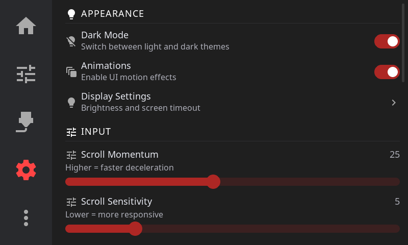

# Settings

Access via the **Gear icon** in the navigation bar. Settings are organized into sections.

| Section | What's Inside |
|---------|---------------|
| [Appearance](settings/appearance.md) | Language, animations, 3D preview, home widgets, display settings (theme, brightness, sleep, time format) |
| [Printer](settings/printer.md) | Filament sensors, AMS, Spoolman, LED settings, retraction, macro buttons |
| [Notifications](settings/notifications.md) | Sound settings (volume, themes, UI sounds), print completion alerts |
| [Motion](settings/motion.md) | Z movement style, machine limits, E-Stop confirmation, cancel escalation |
| [System](settings/system.md) | Network, host, touch calibration, hardware health, plugins, telemetry, restart, factory reset |
| [Help & About](settings/help-about.md) | Debug bundles, Discord, documentation, version info, update channel, print hours |
| [LED Settings](settings/led-settings.md) | Strip selection, auto-state lighting, macro devices, hardware setup guides |

---

**Next:** [Advanced Features](advanced.md) | **Prev:** [Calibration & Tuning](calibration.md) | [Back to User Guide](../USER_GUIDE.md)
