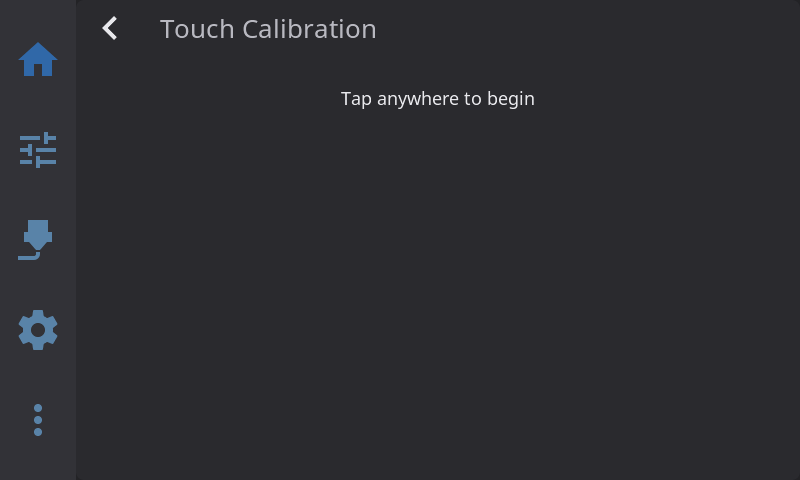
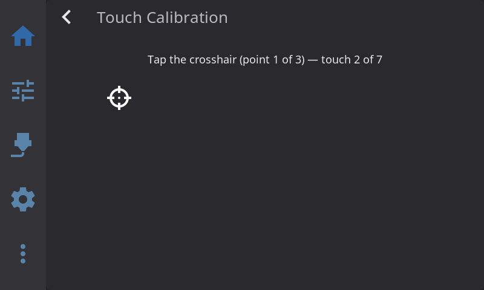
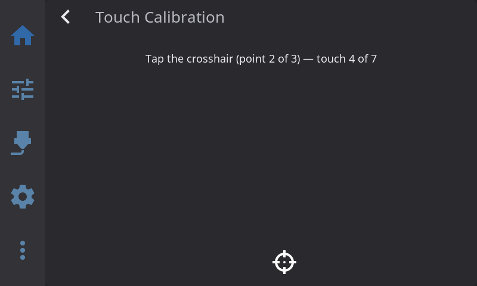
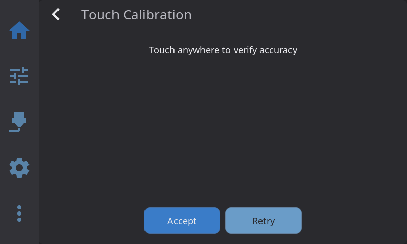

# Touch Calibration

Touch calibration maps the raw coordinates from your touchscreen to the actual positions on the display. Without proper calibration, your taps may land in the wrong place — off by a few millimeters or even centimeters.

**Which screens need calibration?**

- **Resistive touchscreens** — Common on budget printers like the Creality AD5M (sun4i_ts) and Nebula Pad (NS2009). These almost always need calibration.
- **Most capacitive touchscreens** — Goodix, FocalTech, and similar controllers come factory-calibrated. No calibration needed.
- **USB touchscreens** — BTT HDMI displays and generic USB HID screens report pre-mapped coordinates. No calibration needed.
- **Raspberry Pi Official Touchscreen** — Factory calibrated. No calibration needed.

HelixScreen auto-detects your touchscreen type and only prompts for calibration when it's actually needed.

---

## First-Run Calibration

If your screen needs calibration, HelixScreen automatically includes a calibration step during the Setup Wizard the first time you start it.

**How it works:**

1. A "Tap anywhere to begin" prompt appears — tap the screen to confirm your touch works
2. Three crosshair targets appear on screen, one at a time, at different positions
3. Tap the **center** of each crosshair — each point requires **7 taps** and a progress indicator shows "touch 1 of 7", "touch 2 of 7", etc.
4. After all three points, a **verify screen** appears where you can tap around to test accuracy
5. If taps land where you expect, tap **Accept** to save the calibration
6. If something feels off, tap **Retry** to start over









> **Tips:**
> - Use a stylus for best precision, especially on resistive screens
> - Tap — don't drag or slide your finger
> - Take your time; accuracy matters more than speed

---

## Recalibrating from Settings

You may need to recalibrate if:

- Taps are landing in the wrong spot
- You replaced your touchscreen
- You changed the display rotation
- The screen just feels "off"

**To recalibrate:**

1. Go to **Settings > System > Touch Calibration**
2. You'll see a status indicator showing **Calibrated** or **Not calibrated**
3. Tap the option — calibration starts immediately
4. Complete the same 3-point crosshair flow described above

> **Note:** The Touch Calibration option only appears in Settings if HelixScreen detected that your screen needs calibration. If you don't see it, your screen likely doesn't need it — but see the next section if you want to force calibration anyway.

---

## Forcing Recalibration

Sometimes you need to force calibration even when HelixScreen doesn't think it's needed, or when your screen is too broken to navigate the UI. Here are five ways to do it, from easiest to most drastic.

### Method 1: From Settings (easiest)

If you can navigate the UI:

1. Go to **Settings > System > Touch Calibration**
2. Tap to start the calibration flow

### Method 2: Command Line

Use this when your screen is too broken to navigate the UI, or when the calibration option doesn't appear in Settings.

1. SSH into your device
2. Run:
   ```bash
   helix-screen --calibrate-touch
   ```
3. The calibration overlay appears immediately — complete the 3-point crosshair flow
4. After successful calibration, the app continues to start normally

### Method 3: Config File

Use this for automation, remote management, or when you can't run the app interactively.

1. SSH into your device
2. Open the config file for your platform:

   | Platform | Config Path |
   |----------|-------------|
   | MainsailOS | `~/helixscreen/config/helixconfig.json` |
   | AD5M Forge-X | `/opt/helixscreen/config/helixconfig.json` |
   | AD5M Klipper Mod | `/root/printer_software/helixscreen/config/helixconfig.json` |
   | K1 Simple AF | `/usr/data/helixscreen/config/helixconfig.json` |

3. Add `"force_calibration": true` to the `"input"` section:
   ```json
   {
     "input": {
       "force_calibration": true
     }
   }
   ```
4. Restart HelixScreen (or reboot your device)
5. The calibration flow runs on startup, and the `force_calibration` flag is automatically cleared after successful calibration

### Method 4: Reset Existing Calibration

If you want HelixScreen to treat your screen as uncalibrated (so the Setup Wizard includes calibration on next startup):

1. SSH into your device
2. Open the config file (see path table above)
3. Find the `"display"` > `"calibration"` section and set `"valid"` to `false`:
   ```json
   {
     "display": {
       "calibration": {
         "valid": false
       }
     }
   }
   ```
4. Restart HelixScreen — the Setup Wizard will include the calibration step

### Method 5: Factory Reset (nuclear option)

If nothing else works:

1. Go to **Settings > System > Factory Reset**
2. Confirm the reset

This resets **all** settings and re-runs the Setup Wizard from scratch, including calibration if your screen needs it. Only use this as a last resort.

---

## Configuration Reference

### Config File Locations

| Platform | Config Path |
|----------|-------------|
| MainsailOS | `~/helixscreen/config/helixconfig.json` |
| AD5M Forge-X | `/opt/helixscreen/config/helixconfig.json` |
| AD5M Klipper Mod | `/root/printer_software/helixscreen/config/helixconfig.json` |
| K1 Simple AF | `/usr/data/helixscreen/config/helixconfig.json` |

### Calibration Data (`display.calibration`)

Set automatically during calibration. You rarely need to edit this manually.

```json
{
  "display": {
    "calibration": {
      "valid": true,
      "a": 0.0013,
      "b": -0.2642,
      "c": 510.42,
      "d": 0.1768,
      "e": 0.0007,
      "f": -34.75
    }
  }
}
```

| Field | Description |
|-------|-------------|
| `valid` | Whether calibration is active (`true` or `false`) |
| `a` through `f` | Mathematical coefficients that map touch positions to screen positions. Set automatically during calibration. Don't edit these manually unless you know what you're doing. |

### Touch Device Override (`input.touch_device`)

Leave empty (default) for auto-detection. Only set this if HelixScreen picks the wrong input device.

```json
{
  "input": {
    "touch_device": "/dev/input/event1"
  }
}
```

### Force Calibration (`input.force_calibration`)

Forces calibration on the next startup. Automatically cleared after successful calibration.

```json
{
  "input": {
    "force_calibration": true
  }
}
```

---

## Advanced: Environment Variables

For power users and developers. These override config file settings and are useful for testing or unusual setups.

| Variable | Description | Example |
|----------|-------------|---------|
| `HELIX_TOUCH_DEVICE` | Override touch input device | `/dev/input/event1` |
| `HELIX_TOUCH_MIN_X` | Minimum raw X value (linear calibration) | `500` |
| `HELIX_TOUCH_MAX_X` | Maximum raw X value (linear calibration) | `3580` |
| `HELIX_TOUCH_MIN_Y` | Minimum raw Y value (linear calibration) | `3200` |
| `HELIX_TOUCH_MAX_Y` | Maximum raw Y value (linear calibration) | `900` |
| `HELIX_TOUCH_SWAP_AXES` | Swap X and Y axes | `1` |
| `HELIX_DISPLAY_ROTATION` | Display rotation (touch auto-adjusts) | `90`, `180`, `270` |

> **Note:** The MIN/MAX variables provide a simple linear calibration that bypasses the 3-point system. Most users should use the built-in calibration instead.

**Setting environment variables in systemd:**

```ini
# Open an override file for the HelixScreen service
sudo systemctl edit helixscreen

# Add your variables in the editor that opens:
[Service]
Environment="HELIX_TOUCH_DEVICE=/dev/input/event0"
Environment="HELIX_DISPLAY_ROTATION=90"

# Save and close, then restart:
sudo systemctl restart helixscreen
```

---

## Known Devices

| Device / Screen | Type | Needs Calibration? | Notes |
|----------------|------|-------------------|-------|
| Creality AD5M built-in | Resistive (sun4i_ts) | Yes | Auto-detected |
| Nebula Pad | Resistive (NS2009) | Yes | Auto-detected |
| BTT HDMI 5"/7" | USB capacitive | No | Reports mapped coordinates |
| Raspberry Pi Official Touchscreen | Capacitive (Goodix) | No | Factory calibrated |
| Goodix GT911 panels | Capacitive | Usually no | May need calibration if wired to a mismatched-resolution display |
| Generic USB touchscreen | USB HID | No | Reports mapped coordinates |

---

**Next:** [Calibration & Tuning](calibration.md) | [Back to User Guide](../USER_GUIDE.md)
